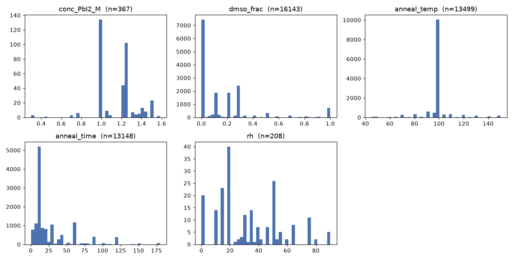
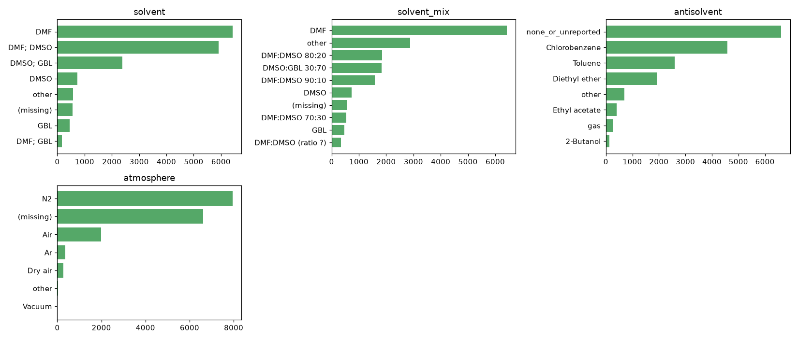
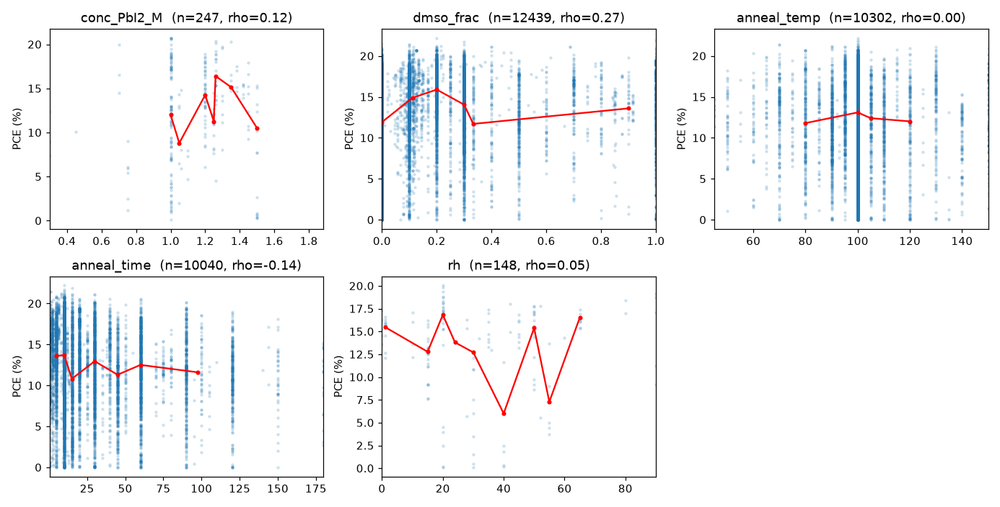
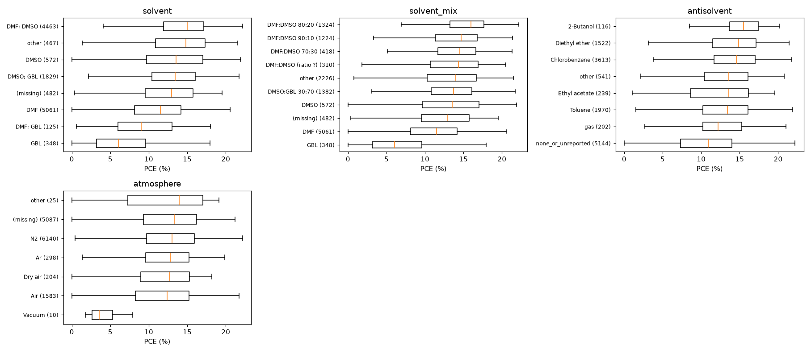
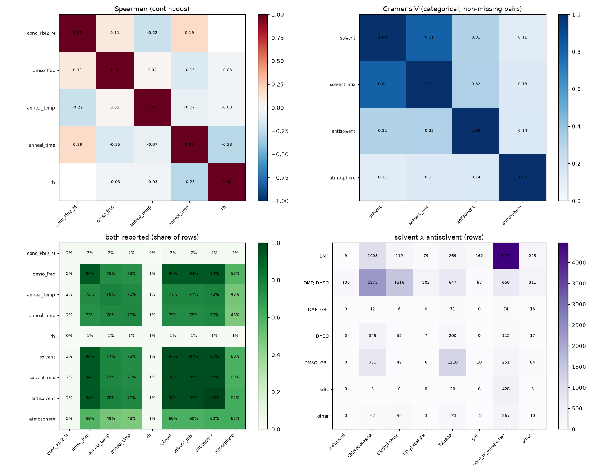
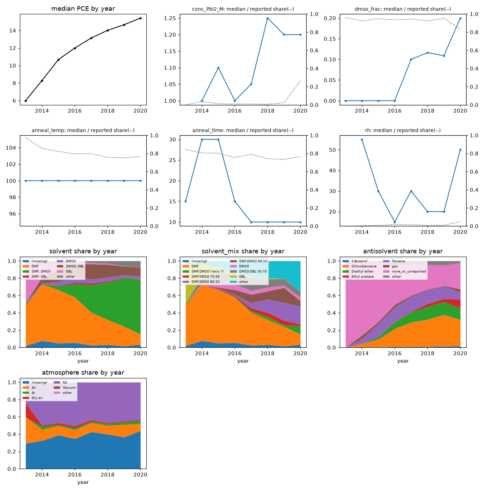
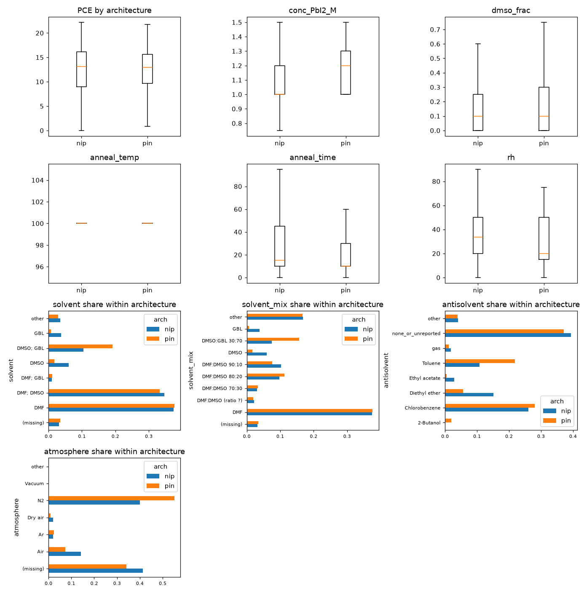

# EDA: 공정 조건 → PCE 예측 모델용 변수 선정

**목표:** 목표 PCE를 넣으면 공정 조건을 역으로 추천하는 것. 이를 위해 먼저 "공정 조건 → PCE" 예측 모델을 만들고, 그 모델로 조건 후보를 탐색합니다.
**대상:** MAPbI3 + one-step 스핀코팅
**재현:** `python pce/eda/eda.py` (숫자는 콘솔에, 그래프는 `eda/figures/`에 저장)

> **분할 변경 (2026-10-02, 외부 검토 반영):** 이 리포트의 train 80% 논문은 EDA 스크립트가 자체로 나눈 분할로 계산했습니다. 이후 모든 스크립트가 같은 분할 파일([splits/doi_split.csv](../splits/doi_split.csv))을 쓰도록 바꿨고, 그 결과 EDA 대상 논문 3,240편 중 1,026편의 train/test 역할이 달라졌습니다. 2018년 이후 데이터가 포함된 스크립트라 아직 다시 돌리지 않았으므로, 3·5절의 train 기준 수치는 새 분할로 다시 실행하면 조금 달라질 수 있습니다. 또 이 EDA는 2018~2020년 논문을 포함해 변수 선택에 쓰였으므로, v2의 변수 구성은 2018년 이후 데이터에 노출된 상태에서 정해졌습니다.

## 0. 데이터와 정제 기준

| 단계 | 행 수 | 비고 |
|---|---|---|
| NOMAD 전체 | 51,640 | 2026-10-01 다운로드 |
| MAPbI + `Spin-coating`(단일 단계) | 17,866 | DB 표기 `MAPbI` = MAPbI3 |
| LLM 자동 추출 행 제외 | −501 | `Ref_extraction_method = LLM`. 원본 2022 CSV에는 없는 데이터 |
| 1 sun(90–110 mW/cm²) 측정만 | −136 | 실내광 측정은 PCE가 25~36%로 기록돼 비교 불가 |
| **분석 대상** | **17,229행 / 논문 3,255편** | |
| PCE 관계 분석용 train(논문 80%) | 13,347행 / 2,592편 | `GroupShuffleSplit`(DOI 단위, seed 0) |

- DB는 결측을 `"Unknown"` 문자열로 저장하므로 결측으로 처리했습니다.
- PCE가 0 이하인 22행은 남겨 두었습니다. 모델링 단계에서 제거 여부를 정해야 합니다.

## 1. 변수 요약

DB 표기 규칙: `;`는 같은 단계 안의 여러 성분(혼합 용매, 화합물 목록)을 구분하고, `>>`는 순차 공정 단계를, `|`는 층을 구분합니다. 따라서 **"여러 단계로 적힌 값"은 `>>` 비율**로 봐야 합니다. 어닐링 온도·시간만은 예외로, `65; 100`처럼 `;`가 단계적 어닐링을 뜻합니다.

| 변수 | DB 컬럼 | 결측 | 변환 후 결측 | 고유값 | 최빈값 비율 | 상위 5개 값 (행 수) | `;` 비율 | `>>` 비율 |
|---|---|---|---|---|---|---|---|---|
| 전구체 농도 (PbI2, M) | `Perovskite_deposition_reaction_solutions_concentrations` | 96.6% | 97.9% | 94 | 19.1% | 1 M; 1 M (111) · 1 M; 1.24 M (72) · 1.2 M; 1.2 M (44) · 1 M; 57 wt%; … (23) · 1.25 M; 1.25 M (17) | 91.0% | 0% |
| 용매 종류 | `Perovskite_deposition_solvents` | 3.3% | 3.3% | 69 | 38.6% | DMF (6430) · DMF; DMSO (5909) · DMSO; GBL (2379) · DMSO (737) · GBL (460) | 53.7% | 0% |
| 용매 혼합비 | `Perovskite_deposition_solvents_mixing_ratios` | 6.3% | 6.3% (DMSO 분율) | 216 | 47.7% | 1 (7712) · 3; 7 (1943) · 4; 1 (1868) · 9; 1 (1547) · 7; 3 (665) | 52.2% | 0% |
| 반용매 | `Perovskite_deposition_quenching_media` (+ `quenching_induced_crystallisation`) | 38.7% | 0%¹ | 72 | 43.4% | Chlorobenzene (4585) · Toluene (2596) · Diethyl ether (1935) · Ethyl acetate (400) · 2-Butanol (139) | 1.0% | 0% |
| 어닐링 온도 (°C) | `Perovskite_deposition_thermal_annealing_temperature` | 8.4% | 21.6%² | 190 | 53.3% | 100 (10,048) · 65; 100 (537) · 90 (525) · 95 (441) | 14.4% | 0.1% |
| 어닐링 시간 (분) | `Perovskite_deposition_thermal_annealing_time` | 10.5% | 23.7%² | 216 | 33.1% | 10 (5113) · 60 (1089) · 30 (1060) · 5 (971) · 15 (877) | 14.7% | 0.1% |
| 제조 분위기 | `Perovskite_deposition_synthesis_atmosphere` | 38.3% | 38.3% | 16 | 74.2% | N2 (7889) · Air (1864) · Ar (370) · Dry air (277) · Ambient (106) | 0% | 0.9% |
| 상대습도 (%) | `Perovskite_deposition_synthesis_atmosphere_relative_humidity` | 98.8% | 98.8% | 25 | 12.5% | 50 (26) · 15 (23) · 20 (40) · 10 (14) | 0% | 0% |
| 스핀코팅 속도 (rpm) | **컬럼 없음** | 100% | — | — | — | NOMAD·원본 CSV 모두 해당 필드 없음 | — | — |
| 스핀코팅 시간 | **컬럼 없음** | 100% | — | — | — | 〃 | — | — |
| *참고:* 출판 연도 | `Ref_publication_date` | 0% | 0% | 1467 (날짜) | — | 2018 (4444) · 2019 (3712) · 2017 (3564) | — | — |
| *참고:* 소자 구조 | `Cell_architecture` | 0% | 0.1% | 3 | 60.1% | nip (10,355) · pin (6854) · Back contacted (19) | — | — |
| *참고:* ETL | `ETL_stack_sequence` | 0.1% | 0.1% | 792 | 21.5% | TiO2-c \| TiO2-mp (3701) · TiO2-c (2894) · PCBM-60 (1960) · PCBM-60 \| BCP (1443) · C60 \| BCP (473) | 1.6% | 0% |
| *참고:* HTL | `HTL_stack_sequence` | 0% | 0% | 960 | 44.9% | Spiro-MeOTAD (7731) · PEDOT:PSS (3654) · NiO-c (998) · none (567) · PTAA (516) | 1.0% | 0% |

¹ 반용매는 정의에 따라 결측이 0%가 됩니다. 종류가 적혀 있으면 그 종류, Ar·N2 같은 가스는 `gas`로 묶었습니다. 사용(True)인데 종류가 없으면 `used_unknown`, False이면 `none_or_unreported`입니다. **False가 실제 미사용인지 기록 누락인지는 구분할 수 없고, 이 범주가 전체의 약 38%입니다.**
² 숫자로 바로 바뀌지 않는 값(`65; 100` 같은 단계적 어닐링 14%)을 결측으로 처리해서 결측률이 올라갔습니다. 마지막 단계 값이나 최고 온도를 꺼내면 대부분 살릴 수 있습니다.

**파생 변수 정의**
- **용매 종류:** 첫 공정 단계의 용매(`>>` 앞부분), 상위 6개 + other.
- **`dmso_frac`:** 혼합비로 계산한 DMSO 부피 분율(0~1). 단일 용매면 0 또는 1입니다.
- **`solvent_mix`:** 용매와 비율을 합친 범주. `4; 1`과 `0.8; 0.2`를 같은 값(`DMF:DMSO 80:20`)으로 정규화했습니다.
- **전구체 농도:** 화합물 목록에서 PbI2 위치의 농도이고, 단위가 M 또는 mol/L인 값만 썼습니다.

## 2. 분포

- **어닐링 온도:** 53%가 100°C에 몰려 있습니다. 예측 모델이 100°C 밖의 구간에서 배울 데이터가 적습니다.
- **어닐링 시간:** 10분이 33%이고, 5·15·30·60분처럼 반올림된 값에 몰려 있습니다.
- **DMSO 분율:** 0(DMF 단독), 0.1~0.3(DMF:DMSO), 1(DMSO 단독) 세 덩어리로 나뉩니다. 사이 구간은 데이터가 거의 없습니다.
- **농도와 습도:** 값이 있는 행이 각각 약 360행, 200행뿐이라 분포를 해석하기 어렵습니다.

## 3. 변수별 PCE 관계 (train 80% 논문만)

| 변수 | 관계 (train) |
|---|---|
| 용매 종류 | PCE 중앙값: GBL 6.0 < DMF;GBL 9.0 < DMF 11.5 < DMSO;GBL 13.4 ≈ DMSO 13.5 < **DMF;DMSO 15.0** |
| 용매 혼합비 | DMSO 분율 Spearman ρ = **0.27**. DMF:DMSO 80:20이 16.0으로 가장 높음 |
| 반용매 | 미사용/미기록 11.0 < gas 12.2 < Toluene 13.4 < Chlorobenzene 14.6 < Diethyl ether 14.9 < 2-Butanol 15.5 |
| 어닐링 온도 | ρ = 0.004. 단조 관계 없음. 구간별 중앙값이 80~120°C에서 12~13%로 평평함 |
| 어닐링 시간 | ρ = −0.14. 짧을수록 약간 높음 |
| 제조 분위기 | N2 13.0 ≈ Ar 12.9 ≈ Dry air 12.7 ≈ Air 12.4. 차이 작음 (Vacuum 10행은 3.5) |
| 전구체 농도 | ρ = 0.12 (n = 252, 신뢰 어려움) |
| 상대습도 | ρ = 0.06 (n = 152, 신뢰 어려움) |
| *참고:* 연도 | ρ = **0.32**. 모든 후보 변수보다 강함 |
| *참고:* 소자 구조 | nip 13.0 ≈ pin 13.0 |

## 4. 후보 변수끼리의 관계

- **연속 변수 간 상관:** 모두 약합니다(|ρ| ≤ 0.28). 다중공선성 문제는 없습니다.
- **범주 변수 간 연관(Cramér's V):**
  - 용매 종류와 `solvent_mix`는 0.81로 거의 같은 정보입니다. 둘 다 넣지 말고 **용매 종류 + `dmso_frac`** 조합을 권장합니다.
  - 용매와 반용매는 0.31로 중간 정도입니다. DMF 단독은 70%가 반용매 미사용/미기록이고, DMSO;GBL은 톨루엔과 자주 같이 쓰입니다(1218행). 두 변수의 효과가 일부 섞여 있습니다.
- **함께 보고된 비율:**
  - 용매, 혼합비, 반용매, 어닐링 온도·시간 다섯 변수가 모두 채워진 행은 약 72%입니다.
  - 여기에 분위기를 더하면 약 45%로 줄어듭니다.
  - 농도나 습도를 더하면 2% 이하로 떨어집니다.

## 5. 교란 요인

### 5-1. 연도

- **PCE 중앙값:** 2013년 6%에서 2020년 15%로 꾸준히 올랐습니다.
- **같은 기간 공정 변화:**
  - DMF 단독이 줄고 DMF;DMSO가 늘었습니다(`dmso_frac` 중앙값 0 → 0.2).
  - 반용매 사용 비율이 0%에서 약 70%로 늘었습니다.
  - 어닐링 시간이 짧아졌습니다.
- **연도와의 상관(Spearman):** `dmso_frac` 0.25, 어닐링 시간 −0.18, 농도 0.31. 단순 비교에서 보이는 효과의 상당 부분은 **연도와 겹칩니다**.
- **연도를 고정한 비교 (train, 2015~2019년 각 연도 안에서):**

| 변수 | 연도 안에서의 효과 | 판단 |
|---|---|---|
| `dmso_frac` | ρ = 0.14 ~ 0.30 (5개 연도 모두 양수) | **유지됨** |
| 반용매 | 미사용/미기록 대비 매년 +1.3 ~ +5.7%p (주요 3종: 클로로벤젠·톨루엔·디에틸에테르). 에틸아세테이트·가스는 연도마다 부호가 바뀜 | **유지됨** (주요 3종) |
| 용매 (DMF;DMSO vs DMF) | 매년 +2.2 ~ +3.1%p | **유지됨** |
| 어닐링 시간 | ρ = −0.04 ~ −0.19 | 약하게 유지 |
| 어닐링 온도 | ρ = −0.13 ~ 0.15, 부호가 연도마다 바뀜 | 단독 효과 없음 |
| 농도 | ρ = 0.64 → −0.26, 연도마다 크게 흔들림 | 표본 부족 |

- **2021년 이후:** LLM 추출 행을 빼고 나면 2020년 344행, 2022년 72행뿐입니다. **최근 공정(2021~2025년)이 데이터에 거의 없습니다.**

### 5-2. 소자 구조 (n-i-p / p-i-n)

- **PCE:** nip 13.1, pin 12.9로 거의 같습니다.
- **공정 분포는 다릅니다:**
  - pin에서 DMSO;GBL(19% vs 10%), 톨루엔(22% vs 11%), N2 분위기가 더 많습니다.
  - nip에서는 디에틸에테르와 Air가 더 많습니다.
  - 농도 중앙값은 pin 1.2 M, nip 1.0 M이고, 어닐링 시간 중앙값은 pin 10분, nip 15분입니다.
- 같은 공정이라도 구조에 따라 적합한 조건이 다를 수 있습니다. 역추천은 **구조를 먼저 정한 뒤 그 조건 아래에서** 하는 것이 맞습니다.

## 6. 데이터 파일 비교: 원본 2022 CSV vs NOMAD

| 항목 | 원본 CSV (`Perovskite_database_content_all_data.csv`) | NOMAD (`data/perovskite_db.csv`) |
|---|---|---|
| 출처 | [Jesperkemist/perovskitedatabase_data](https://github.com/Jesperkemist/perovskitedatabase_data) (Zenodo 10.5281/zenodo.5834698) | NOMAD API, 2026-10-01 |
| 행 수 | 42,443 | 51,640 |
| 컬럼 수 | 410 | 572 |
| 공통 컬럼 | 380 | 380 |
| 출판 연도 범위 | 2009–2021 | 2009–2026 |
| 논문 수 (DOI) | 7,358 | 10,204 |
| 양쪽 모두에 있는 논문 | 7,358 (원본 전부) | |
| 한쪽에만 있는 논문 | 0 | 2,846 |
| MAPbI + one-step 행 | 17,298 | 17,866 |

- **NOMAD에만 있는 데이터:** 8,532행은 `Ref_extraction_method = LLM`(자동 추출)이고, 사람이 입력한 행은 641행입니다. 원본에 있는 논문은 NOMAD에 모두 들어 있습니다.
- **NOMAD에만 있는 컬럼 191개(`entry_id` 제외):** 대부분 리스트를 펼친 컬럼입니다. 이온별 정보(`Perovskite_ions.N.*`)와 저자 목록(`Ref_authors.N.*`)이고, 의미 있는 새 필드는 `Ref_extraction_method`뿐입니다.
- **원본에만 있는 컬럼 30개:** 대부분 `Add_lay_front/back_*`의 세부 필드입니다. `Encapsulation`, `Module`은 NOMAD에서 `Encapsulation_Encapsulation`, `Module_Module`로 이름만 바뀌었습니다. 이번 EDA 후보 변수와는 관련이 없습니다.

**후보 컬럼이 채워진 비율**

| 컬럼 | 원본 전체 | NOMAD 전체 | 원본 MAPbI 1-step | NOMAD MAPbI 1-step |
|---|---|---|---|---|
| 전구체 농도 | 3.4% | 9.1% | 2.9% | 5.6% |
| 용매 | 97.5% | 86.8% | 96.7% | 96.4% |
| 용매 혼합비 | 95.0% | 83.7% | 93.7% | 93.1% |
| 반용매 종류 | 47.3% | 43.4% | 61.1% | 61.7% |
| 어닐링 온도 | 91.9% | 81.8% | 91.6% | 91.1% |
| 어닐링 시간 | 89.6% | 79.7% | 89.5% | 89.0% |
| 제조 분위기 | 65.0% | 62.2% | 61.6% | 62.8% |
| 상대습도 | 1.6% | 1.3% | 1.2% | 1.2% |
| 스핀코팅 속도·시간 | 컬럼 없음 | 컬럼 없음 | — | — |
| PCE | 97.8% | 97.9% | 98.0% | 98.1% |

- 두 파일의 채움률은 MAPbI 1-step 범위에서 거의 같습니다. NOMAD 전체에서 채움률이 낮은 것은 LLM 추출 행에 빈 필드가 많기 때문입니다.
- **스핀코팅 속도·시간은 어느 파일에서도 얻을 수 없습니다.** 이 변수가 꼭 필요하면 원 논문에서 다시 추출하거나, 다른 데이터셋(예: 텍스트 마이닝 기반 DB)이 필요합니다.

## 7. 변수 추천

| 변수 | 추천 | 이유 |
|---|---|---|
| 용매 종류 | **사용** | 결측 3.3%. PCE 차이가 크고(GBL 6.0 ~ DMF;DMSO 15.0) 연도를 고정해도 유지됨. 역추천에서 직접 고를 수 있는 변수 |
| 용매 혼합비 (`dmso_frac`) | **사용** | 결측 6.3%. 연도 고정 후에도 ρ 0.14~0.30. 연속값이라 탐색하기 좋음. 단 0.3~0.9 구간은 데이터가 희박해 그 구간 추천은 외삽이 됨. 범주형 `solvent_mix`는 용매 종류와 중복(V = 0.81)이라 제외 |
| 반용매 사용 여부·종류 | **사용** | 연도 고정 후에도 주요 3종이 매년 +1.3~5.7%p로 가장 일관된 효과. 단 `none_or_unreported`(38%)에 미기록이 섞여 있어, 추천 결과에 "미사용"이 나오면 해석에 주의 |
| 어닐링 온도 | **조건부 사용** | 단독 효과는 없음(ρ ≈ 0, 부호 불안정). 53%가 100°C. 역추천의 핵심 조절 변수라 넣되, 단계적 어닐링(14%)을 최고 온도 등으로 파싱해 결측을 21.6%에서 약 8%로 줄일 것. 모델의 변수 중요도가 낮으면 고정값(100°C)으로 처리 |
| 어닐링 시간 | **조건부 사용** | ρ −0.14 중 일부는 연도 효과. 연도 고정 후 −0.04~−0.19로 약함. 온도와 같은 방식으로 파싱 후 사용 |
| 제조 분위기 | **조건부 사용** | 결측 38%. 값이 있는 범위에서 N2·Ar·Air 차이가 0.6%p 이내로 작음. 결측을 별도 범주로 두고 넣어 보고, 기여가 없으면 제외 |
| 전구체 농도 | **제외** | 변환 후 결측 97.9%(train 252행). 연도마다 상관이 0.64~−0.26으로 흔들림. 다른 변수와 동시에 채워진 행이 2% |
| 상대습도 | **제외** | 결측 98.8% |
| 스핀코팅 속도 (rpm) | **제외** | DB에 컬럼 없음 (두 파일 모두) |
| 스핀코팅 시간 | **제외** | DB에 컬럼 없음 (두 파일 모두) |
| *참고:* 출판 연도 | **보정용으로 사용** | PCE와 가장 강한 관계(ρ 0.32). 주요 공정 변화와 함께 움직임. 학습에는 넣고, 역추천할 때는 최근 연도로 고정해 "연도 효과"가 추천 조건에 섞이지 않게 할 것. 추천 대상이 아니라 통제 변수 |
| *참고:* 소자 구조 | **조건 변수로 사용** | PCE는 같지만 공정 분포가 구조마다 다름. 사용자가 먼저 정하고, 그 조건에서 공정을 추천 |
| *참고:* ETL / HTL | **조건부 사용 (보정용)** | 고유값이 790~960개로 매우 많고 구조와 강하게 묶여 있음. 상위 5~6개로 묶어 보정 변수로 넣는 것을 권장 (baseline R² 0.14가 낮았던 주요 원인으로 추정). 추천 대상이 아니라 조건 |

## 8. 모델링 전에 정할 것

1. **학습 데이터의 시간 범위:** LLM 행을 빼면 2021년 이후 데이터가 거의 없어서, 모델은 "2020년까지의 공정"만 압니다. 최근 조건을 추천하려면 LLM 행의 품질을 검증한 뒤 포함하는 것도 고려해 볼 수 있습니다.
2. **반용매 미기록 처리:** `none_or_unreported`를 그대로 범주로 둘지, 반용매 정보가 있는 논문만 학습에 쓸지 정해야 합니다.
3. **중복 행:** 원본 DB에 같은 소자가 반복된 행이 있습니다. 논문 단위로 분할하므로 train/test 간 누수는 없지만, 가중치에 영향을 줍니다.
4. **입력 변수 확정:** 위 추천대로라면 최소 입력은 용매 + DMSO 분율 + 반용매 + 어닐링 온도·시간이고, 보정 변수로 연도·구조·ETL·HTL을 넣습니다. 이 구성으로 쓸 수 있는 행은 약 72%(PCE 포함 12,158행)입니다.

## 9. 전체 컬럼 스캔: 1~8절 외의 추가 후보

**재현:** `python pce/eda/eda.py scan`
**대상:** 1~8절과 같은 정제 데이터 (17,229행, PCE 관계는 같은 train 80% 논문 13,347행)

### 9-1. 스캔 기준

- **결측 처리:** `"Unknown"` 외에, 스키마 기본값으로 채워진 자리표시 값(`nan; nan`, `0000:00:00:00:00`)도 결측으로 봤습니다. Stability·Outdoor 계열 컬럼이 100% 채워진 것처럼 보였던 것은 이 값 때문입니다.
- **True/False 컬럼(37개):** 기본값이 False라서 채움률은 항상 100%입니다. 그래서 채움률 대신 **True 비율**을 보고, True가 1% 미만이면 제외했습니다. False는 "아님 또는 미기록"으로 해석합니다.
- **남긴 컬럼:** True/False가 아닌 컬럼은 채움률 30% 이상(95개), True/False 컬럼은 True 1% 이상(13개)을 남겨 모두 108개입니다.
- **예외:** 측정 보정 후보(히스테리시스 관련)는 보정 용도라 10% 이상이면 포함했습니다.

**108개 중 새 후보가 아닌 컬럼**

| 이유 | 개수 | 예 |
|---|---|---|
| 1~8절에서 이미 분석했거나 서지 정보 | 24 | `Ref_*`, `entry_id`, 용매·반용매·어닐링 컬럼 |
| MAPbI3 one-step 필터로 값이 고정됨 | 43 | `Perovskite_composition_*`, `Perovskite_ions.*`, `Perovskite_band_gap`, `Perovskite_dimension_*` |
| 안정성·실외 등 플래그만 있음 (측정값은 30% 미만) | 7 | `Stabilised_performance_measured`, `EQE_measured`, `Module_*` |
| PCE·Voc·Jsc·FF와 같은 측정값 | 7 | `JV_reverse_scan_*`, `JV_default_*_scan_direction` |
| 소자 구조·ETL·HTL과 같은 정보 | 1 | `Cell_stack_sequence` |
| 셀 개수·측정 플래그 | 3 | `Cell_number_of_cells_per_substrate`, `Cell_semitransparent`, `JV_measured` |

### 9-2. 첨가제: "Undoped"와 빈칸 구분

| 상태 | 비율 | train PCE 중앙값 | 연도 고정 시 빈칸 대비 |
|---|---|---|---|
| 첨가제 이름 있음 | 33.3% | (종류별 아래 참고) | |
| `Undoped` (명시적으로 없음) | 2.6% | 14.0 (n=309) | −1.1 ~ +3.0%p (5개 연도) |
| 빈칸 (기록 없음) | 64.1% | 13.3 (n=8,582) | 기준 |
| └ Cl | | 11.3 (n=2,446) | **−2.4 ~ −0.4%p** (5개 연도 모두 음수) |
| └ Pb(SCN)2 | | 16.3 (n=55) | +3.5 ~ +4.4%p (2개 연도뿐) |
| └ Acetate | | 11.9 (n=44) | −4.4 ~ +2.3%p |

- **"명시적으로 없음"은 2.6%뿐**이고, 빈칸이 64%입니다. 빈칸과 `Undoped`의 PCE 차이는 연도에 따라 부호가 바뀌므로, **빈칸을 "첨가제 없음"으로 간주할 근거는 약합니다.** baseline.py에서는 빈칸을 "첨가제 없음"으로 처리했는데, 이 가정은 다시 검토해야 합니다.
- **Cl이 첨가제 중 가장 흔하지만(3,119행), 매년 빈칸보다 PCE가 낮습니다.** 초기 MAPbI3-xClx 계열 공정이 섞인 영향으로 보입니다. "첨가제 있음/없음" 하나로 묶으면 이 효과가 섞여 사라지므로, 쓴다면 종류별로 나눠야 합니다.

### 9-3. 후보 목록과 PCE 관계

"연도 고정"은 2015~2019년 각 연도 안에서 기준 범주와의 중앙값 차이(범주형) 또는 Spearman ρ(연속형)의 최솟값~최댓값입니다. 연도별로 범주당 10행 이상, 연속형은 30행 이상일 때만 계산했습니다.

#### (a) 공정 변수 후보

| 컬럼 | 채움률 | 고유값 | 상위 5개 값 (행 수) | train PCE 관계 | 연도 고정 |
|---|---|---|---|---|---|
| `Perovskite_additives_compounds` | 35.9% | 501 | Cl (3119) · Undoped (447) · Acetate (100) · Pb(SCN)2 (70) · Acetate; Cl (68) | 9-2 참고 | Cl −2.4 ~ −0.4%p |
| `Perovskite_deposition_solvent_annealing` | True 2.5% | 2 | False (16,794) · True (435) | True 14.9 vs False 13.0 | **+0.9 ~ +2.9%p** (5개 연도) |
| `Perovskite_thickness` (nm) | 32.4% | 193 | 300 (990) · 400 (697) · 350 (509) · 450 (374) · 250 (354) | ρ 0.29 (n=4,364) | ρ 0.09 ~ 0.50 (7개 연도, 모두 양수) |

#### (b) 조건 변수 후보

| 컬럼 | 채움률 | 고유값 | 상위 5개 값 (행 수) | train PCE 중앙값 | 연도 고정 (기준 대비) |
|---|---|---|---|---|---|
| `Backcontact_stack_sequence` | 100% | 162 | Au (6789) · Ag (6715) · Al (1883) · MoO3 \| Ag (353) · Carbon (339) | Au 13.4, Ag 13.4, Al 12.0, Carbon 9.9 | Ag −1.2 ~ +1.2, Al −1.8 ~ +0.3, **Carbon −5.1 ~ −3.3** (기준 Au) |
| `Backcontact_deposition_procedure` | 99.5% | 66 | Evaporation (15,487) · Evaporation \| Evaporation (637) · Doctor blading (238) · Sputtering (118) · Screen printing (102) | 증착 13.2, 닥터블레이드 10.3, 스크린 10.5 | 닥터블레이드 −5.0 ~ −1.7, 스크린 −7.0 ~ −1.5 |
| `Backcontact_thickness_list` (nm) | 81.9% | 227 | 100 (5865) · 80 (3070) · 60 (854) · 120 (745) · 150 (659) | ρ −0.04 | ρ −0.14 ~ 0.10 |
| `Substrate_stack_sequence` | 100% | 102 | SLG \| FTO (9435) · SLG \| ITO (7135) · PET \| ITO (169) · PEN \| ITO (116) · PET \| IZO (54) | FTO 13.1, ITO 13.1, PET\|ITO 10.4 | ITO −1.1 ~ +0.8, PET\|ITO −5.5 ~ +1.2 |
| `Cell_flexible` | True 3.0% | 2 | False (16,707) · True (522) | True 11.5 vs False 13.1 | **−3.7 ~ −0.6%p** (5개 연도) |
| `ETL_thickness` (nm) | 42.8% | 775 | 50 (509) · 40 (316) · 30 (276) · 60 (235) · 20 (213) | ρ −0.16 (n=2,047) | ρ −0.18 ~ −0.07 (6개 연도, 모두 음수) |
| `ETL_deposition_procedure` | 98.2% | 195 | Spin \| Spin (5516) · Spin (5425) · Spray-pyrolysis \| Spin (1243) · Spin \| Evap (919) · Evap \| Evap (523) | 12.3 ~ 13.6 | −1.6 ~ +2.9, 일관성 없음 |
| `HTL_deposition_procedure` | 96.3% | 83 | Spin (14,947) · Spin \| Spin (592) · Spray-pyrolysis (192) · Evaporation (120) · Spin \| Evap (76) | Spin 13.1, Evaporation 7.8 | Evaporation −8.0 ~ −3.9 (3개 연도), Spin\|Spin +0.5 ~ +2.6 |
| `HTL_additives_compounds` | 52.4% | 206 | Li-TFSI; TBP (6542) · FK209; Li-TFSI; TBP (783) · Undoped (277) · FK102; Li-TFSI; TBP (182) · Cu (109) | Li-TFSI;TBP 13.5, Undoped 13.2 | Undoped −3.4 ~ −1.4 (3개 연도), FK209 −3.8 ~ +1.1 |
| `Encapsulation_Encapsulation` | True 3.5% | 2 | False (16,621) · True (608) | True 11.8 vs False 13.1 | −3.1 ~ +1.2, 일관성 없음 |
| `Add_lay_front` / `Add_lay_back` | True 0.4% / 0.1% | 2 | | | True 1% 미만 → 제외 |

#### (c) 측정 보정 후보

| 컬럼 | 채움률 | 고유값 | 상위 5개 값 (행 수) | train PCE 관계 | 연도 고정 |
|---|---|---|---|---|---|
| `Cell_area_measured` (cm²) | 98.9% | 273 | 0.1 (5175) · 0.09 (2709) · 0.16 (1305) · 0.04 (1026) · 0.06 (686) | ρ 0.00 | ρ −0.11 ~ 0.12 |
| `JV_default_PCE_scan_direction` | 98.1% | 3 | Reversed (15,523) · Stabilised (1071) · Forward (303) | Reverse 12.8, Stabilised 15.7, Forward 12.7 | **Stabilised +1.7 ~ +2.6**, Forward −2.7 ~ +2.4 |
| `JV_scan_speed` (mV/s) | 35.2% | 101 | 100 (1846) · 50 (836) · 10 (541) · 200 (357) · 1000 (297) | ρ −0.10 | ρ −0.30 ~ 0.21, 부호 불안정 |
| `JV_test_atmosphere` | 43.5% | 7 | Air (5334) · N2 (1712) · Ambient (318) · Ar (49) · Dry air (45) | Air 13.0, N2 13.0 | N2 −2.7 ~ +1.0, 일관성 없음 |
| `JV_average_over_n_number_of_cells` | 100% | 75 | 1 (11,653) · 2 (1740) · 20 (643) · 10 (535) · 30 (304) | ρ 0.00 | ρ −0.12 ~ 0.08 |
| `JV_light_masked_cell` | True 1.9% | 2 | False (16,903) · True (326) | 12.9 vs 13.0 | −4.8 ~ +1.7, 일관성 없음 |
| `JV_certified_values` | True 0.1% | 2 | | | True 1% 미만 → 제외 |
| `JV_hysteresis_index` *(10% 예외)* | 18.3% | 2967 | 0.0 (62) · … (연속값) | ρ −0.40 (n=2,405) | ρ −0.49 ~ 0.19, 부호 불안정 |
| reverse − forward PCE *(파생, 10% 예외)* | 18.7% | 1236 | 0.0 (127) · 0.2 (47) · 0.5 (45) · 0.3 (42) · 0.4 (28) | ρ −0.01 | ρ −0.14 ~ 0.35 |

#### (d) 목표 후보

| 컬럼 | 채움률 | 고유값 | 상위 5개 값 (행 수) | PCE와의 관계 (train) | 연도 고정 |
|---|---|---|---|---|---|
| `JV_default_Voc` (V) | 94.9% | 727 | 1.05 (588) · 1.06 (564) · 1.02 (538) · 1.04 (513) · 1.03 (513) | ρ 0.78 | ρ 0.68 ~ 0.80 |
| `JV_default_Jsc` (mA/cm²) | 95.0% | 2325 | 21.0 (130) · 20.5 (118) · 21.5 (111) · 20.0 (105) · 21.3 (102) | ρ 0.82 | ρ 0.73 ~ 0.87 |
| `JV_default_FF` | 94.5% | 655 | 0.72 (486) · 0.73 (459) · 0.75 (439) · 0.74 (418) · 0.71 (417) | ρ 0.78 | ρ 0.62 ~ 0.80 |
| `Stability_measured` | True 16.0% | 2 | False (14,480) · True (2749) | True 15.1 vs False 12.6 | +1.2 ~ +2.1%p |

- **Voc·Jsc·FF로 계산한 PCE 검증:** 네 값이 모두 있는 16,249행 중 계산값(Voc×Jsc×FF)과 기록된 PCE가 1%p 넘게 다른 행은 4.6%, 3%p 넘게 다른 행은 1.4%입니다. FF가 1보다 큰(% 단위로 입력된) 행도 6개 있습니다. **이 차이를 이상치 필터로 쓸 수 있습니다.**
- **안정성 테스트를 한 소자가 PCE가 더 높은 것은 선택 효과입니다.** 성능이 좋은 소자일수록 안정성 테스트까지 하기 때문이고, 안정성이 PCE를 높인다는 뜻이 아닙니다.

### 9-4. 기준 미달 항목 (채움률만 표시)

| 컬럼 | 채움률 | 범주 |
|---|---|---|
| `Perovskite_deposition_reaction_solutions_compounds` (전구체 화합물 구성) | 3.5% | (a) |
| `Perovskite_additives_concentrations` (첨가제 농도) | 11.6% | (a) |
| `Perovskite_deposition_substrate_temperature` (기판 온도) | 1.7% | (a) |
| `Perovskite_deposition_reaction_solutions_temperature` (용액 온도) | 1.5% | (a) |
| `Perovskite_deposition_reaction_solutions_age` (용액 숙성) | 0.5% | (a) |
| `Perovskite_deposition_thermal_annealing_atmosphere` (어닐링 분위기) | 2.8% | (a) |
| `Perovskite_deposition_thermal_annealing_relative_humidity` (어닐링 습도) | 0.3% | (a) |
| `Perovskite_surface_treatment_before_next_deposition_step` (표면처리) | 0.0% | (a) |
| `Perovskite_deposition_after_treatment_of_formed_perovskite` (후처리) | 1.3% | (a) |
| `Perovskite_deposition_quenching_media_volume` (반용매 부피) | 1.8% | (a) |
| `HTL_thickness_list` (HTL 두께) | 25.8% | (b) |
| `Stability_PCE_T80` | 4.5% | (d) |
| `Stability_PCE_initial_value` | 6.5% | (d) |
| `Stability_PCE_end_of_experiment` | 15.9% | (d) |
| `Stability_time_total_exposure` | 15.9% | (d) |
| `Stability_PCE_after_1000_h` | 1.7% | (d) |

### 9-5. 추가 후보 추천

| 컬럼 | 범주 | 추천 | 이유 |
|---|---|---|---|
| `Perovskite_deposition_solvent_annealing` | (a) | **조건부 사용** | 5개 연도 모두 +0.9~2.9%p로 일관됨. 단 True가 2.5%(train 325행)뿐이라 추천 결과에 자주 나오면 근거가 얇음 |
| `Perovskite_additives_compounds` | (a) | **조건부 사용** | 빈칸(64%)을 "없음"으로 볼 수 없음. `{빈칸, Undoped, Cl, 기타}`처럼 상위 종류별 범주로 넣을 것. Cl의 음의 효과는 일관됨 |
| `Perovskite_thickness` | (a) | **조건부 사용 (중간 목표로)** | 채움률 32%, 연도 고정 후에도 모두 양의 상관(0.09~0.50). 직접 설정하는 값이 아니라 농도·rpm의 결과라서 입력보다는 "목표 두께"로 추천하는 용도가 맞음. DB에 없는 rpm·농도를 대신하는 지표 역할도 함 |
| `Backcontact_stack_sequence` | (b) | **조건 변수로 사용** | Au와 Ag는 차이가 없고, Carbon은 매년 −3~−5%p로 일관됨. Au/Ag/Al/Carbon/other로 묶어 사용 |
| `Cell_flexible` | (b) | **조건 변수로 사용** | 5개 연도 모두 −0.6~−3.7%p. 기판 컬럼보다 단순하고 같은 정보를 담음 → `Substrate_stack_sequence`는 제외 |
| `ETL_thickness` | (b) | **조건부 사용** | 채움률 43%, 연도 고정 후에도 약하지만 일관되게 음의 상관(−0.07~−0.18). ETL 종류와 함께 넣을 것 |
| `HTL_additives_compounds` | (b) | **조건부 사용** | 사실상 Spiro-MeOTAD(nip)일 때만 의미가 있음. HTL 종류와 함께 넣어야 하며, 도펀트를 쓰지 않은 경우가 −1.4~−3.4%p |
| `HTL_deposition_procedure` | (b) | **제외** | 대부분(87%) 스핀코팅. 증착이 낮게 나오지만 3개 연도·109행뿐이고 HTL 종류와 겹침 |
| `Backcontact_deposition_procedure` | (b) | **제외** | 후면전극 재료와 중복 (Carbon = 닥터블레이드/스크린프린팅) |
| `Backcontact_thickness_list`, `ETL_deposition_procedure`, `Encapsulation_Encapsulation` | (b) | **제외** | 연도 고정 시 효과가 없거나 부호가 바뀜 |
| `Substrate_stack_sequence` | (b) | **제외** | FTO와 ITO는 차이가 없고, 유연 기판 효과는 `Cell_flexible`로 대체 |
| `JV_default_PCE_scan_direction` | (c) | **보정 변수로 사용** | Stabilised가 Reverse보다 매년 +1.7~2.6%p로 일관됨. 예측할 때는 "Reverse"로 고정해 측정 방식 차이를 제거 |
| `Cell_area_measured` | (c) | **제외** | 98.9% 채워졌지만 PCE와 관계 없음 (ρ 0.00, 연도 고정 −0.11~0.12). 대부분 0.1 cm² 이하의 작은 셀이라 면적 효과가 드러나지 않음 |
| `JV_hysteresis_index`, reverse−forward PCE | (c) | **입력으로는 제외 (품질 필터로만)** | 소자를 만든 뒤에야 측정되는 값이라 예측 시점에 알 수 없음(데이터 누수). 연도 고정 시 부호도 불안정 |
| `JV_scan_speed`, `JV_test_atmosphere`, `JV_average_over_n_number_of_cells`, `JV_light_masked_cell` | (c) | **제외** | 연도 고정 시 효과가 없거나 부호가 바뀜 |
| `JV_certified_values`, `Add_lay_front`, `Add_lay_back` | (b)(c) | **제외** | True 1% 미만 |
| `JV_default_Voc`, `Jsc`, `FF` | (d) | **보조 목표 + 품질 필터로 사용** | 채움률 95%. 각각 PCE와 ρ 0.78~0.82. 주 목표는 PCE로 두고, Voc·Jsc·FF를 함께 예측하면 "어떤 손실 때문에 효율이 낮은지" 설명할 수 있음. Voc×Jsc×FF와 PCE의 차이가 1%p를 넘는 4.6%는 이상치 후보 |
| 안정성 지표 (T80, 종료 PCE 등) | (d) | **제외** | 모두 채움률 16% 이하. 안정성을 목표로 하려면 다른 데이터가 필요함 |

### 9-6. 1~8절 결론에 대한 수정 사항

1. **첨가제 처리:** "빈칸 = 첨가제 없음"이라는 baseline의 가정은 근거가 약합니다. 첨가제는 종류별 범주로 다시 정의해야 합니다.
2. **입력 변수 추가 후보:** 8절의 최소 입력(용매, DMSO 분율, 반용매, 어닐링 온도·시간)에 다음을 더할 수 있습니다.
   - 공정: solvent annealing 여부, 첨가제 종류
   - 조건: 후면전극, 유연 기판 여부, ETL 두께, HTL 첨가제
   - 보정: PCE 스캔 방향
3. **데이터 정제 추가:** Voc×Jsc×FF와 PCE 정합성 검사, FF가 % 단위로 들어간 6행 수정.
