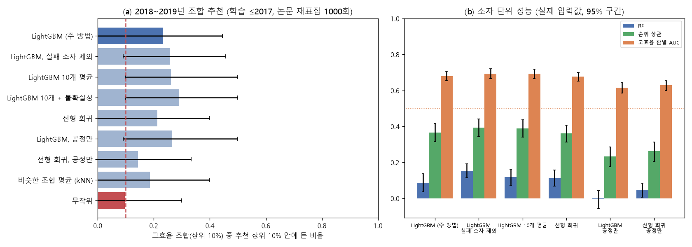

# 실험 2: 과거로 학습해서 미래의 고효율 조합을 고를 수 있나

**질문:** 2017년까지의 논문으로만 학습한 모델이, 학습 때 존재하지 않았던 2018~2019년 논문에서 고효율 공정 조합을 무작위보다 잘 골라내는가?

**사전 계획:** [experiments/exp2/PLAN.md](../experiments/exp2/PLAN.md). 실행 전에 커밋했습니다(`d7a6b2f`).
**재현:** `python experiments/exp2/exp2_future.py` (약 2분). 시험 실행은 `--smoke` 옵션입니다.
**결과 파일:** [results_exp2.md](../experiments/exp2/results_exp2.md) · 원시 결과 [bootstrap_exp2_20261003_233017.csv](../experiments/exp2/bootstrap_exp2_20261003_233017.csv) · 그림 [exp2_summary.png](../experiments/exp2/figures/exp2_summary.png)

## 결론

| 판정 항목 | 기준 | 결과 | 판정 |
|---|---|---|---|
| **주 판정** | LightGBM의 "추천 상위 10% 안 정답 비율" 95% 구간 하한 > 0.10 | 0.23 (95% 구간 **0.00**~0.44) | **미달** |
| 보강 근거 | 소자 단위 고효율 판별 AUC 95% 구간 하한 > 0.5 | 0.68 (0.65~0.71) | 충족 |

**사전에 정한 성공 기준을 충족하지 못했습니다.** 과거 데이터로 학습한 모델이 미래의 고효율 공정 조합을 무작위보다 잘 고른다고 **주장할 수 없습니다.**

다만 다음 두 가지도 함께 보고합니다.
- **소자 단위로는 무작위보다 나은 신호가 남아 있습니다.** 미래 논문의 소자 하나하나에 대해 "고효율인가"를 가르는 능력(AUC 0.68)은 무작위(0.5)보다 확실히 높습니다.
- **조합 단위에서 실패한 주된 이유는 표본 부족으로 보입니다.** 모든 방법의 평균(0.14~0.29)이 무작위(0.10)보다 높지만, 정답 조합이 15개뿐이라 구간이 0~0.5로 넓습니다. 조합 하나를 맞히고 못 맞히는 차이가 지표로 0.07입니다.

## 1. 설계 요약 (사전 계획대로)

| 항목 | 내용 |
|---|---|
| 학습 | 2017년까지 전부: 8,127행, 논문 1,688편 |
| 평가 | 2018~2019년: 7,515행, 논문 1,421편 |
| 후보 조합 | 2018~2019년 조합 중 소자 3개 이상 + 논문 2편 이상: **146개**. 그중 2017년까지 없던 새 조합 45개 |
| 정답 | 후보 중 평균 효율 상위 10%: 15개. 보조로 논문별 평균 기준도 계산 |
| 점수 | 후보 조합의 실제 2018~2019년 소자 구성으로 예측. 연도는 2017, 측정 방식은 Reverse로 고정 |
| 불확실성 | 2018~2019년 논문을 1,000번 다시 뽑아 매번 후보·정답을 다시 정함. 모델은 고정 |
| 하이퍼파라미터 | 2017년까지 데이터로 고른 설정 그대로 |

**계획에서 바뀐 점:** 없습니다. 실행 전에 2017년까지 데이터 안에서 시험 실행(2015년까지 학습 → 2016~2017년 평가)으로 코드를 점검했습니다. 그 뒤 결과 파일의 숫자 표기(F1 기준값) 한 줄만 고쳤고, 분석 내용은 바뀌지 않았습니다.

## 2. 조합 추천 결과 (주 지표)

"고효율 조합(상위 10%) 중 추천 상위 10% 안에 든 비율"입니다. 무작위로 고르면 0.10입니다.

| 방법 | 원래 데이터 | 재표집 평균 | 95% 구간 |
|---|---|---|---|
| **LightGBM (주 방법)** | 0.27 | **0.23** | **0.00 – 0.44** |
| LightGBM, 실패 소자 제외 | 0.27 | 0.26 | 0.09 – 0.45 |
| LightGBM 10개 평균 | 0.20 | 0.26 | 0.10 – 0.50 |
| LightGBM 10개 + 불확실성 | 0.33 | 0.29 | 0.10 – 0.50 |
| 선형 회귀 | 0.20 | 0.21 | 0.00 – 0.40 |
| LightGBM, 공정만 | 0.40 | 0.27 | 0.09 – 0.50 |
| 선형 회귀, 공정만 | 0.13 | 0.14 | 0.00 – 0.33 |
| 비슷한 조합 평균 (kNN) | 0.27 | 0.19 | 0.00 – 0.40 |
| 무작위 | 0.13 | 0.10 | 0.00 – 0.30 |

- **무작위보다 낫다고 확인된 방법은 없습니다.** 구간 하한이 0.10을 넘은 방법이 하나도 없습니다. LightGBM 10개 평균과 10개 + 불확실성은 하한이 정확히 0.10이지만, 기준은 "0.10보다 높음"이라 충족하지 못합니다.
- **방향은 일관됩니다.** 무작위를 뺀 모든 방법의 평균이 0.14~0.29로 무작위보다 높습니다. 신호가 없다기보다, 이 표본 크기로는 확인할 수 없다는 쪽에 가깝습니다.
- **보조 정답(논문별 평균 기준)으로 바꿔도 결론은 같습니다.** 주 방법은 0.21(0.00~0.40)입니다.

## 3. 방법 간 짝지은 비교

같은 재표집에서 (방법 − 주 방법)의 차이입니다.

| 비교 | 평균 차이 | 95% 구간 | 높음 / 같음 / 낮음 | 판단 |
|---|---|---|---|---|
| 실패 소자 제외 − 주 방법 | +0.03 | −0.20 ~ +0.22 | 39% / 38% / 23% | 우열 판단 증거 부족 |
| 10개 평균 − 주 방법 | +0.03 | −0.11 ~ +0.20 | 38% / 48% / 14% | 우열 판단 증거 부족 |
| 10개 + 불확실성 − 주 방법 | +0.06 | −0.11 ~ +0.22 | 53% / 37% / 10% | 우열 판단 증거 부족 |
| 선형 회귀 − 주 방법 | −0.02 | −0.20 ~ +0.20 | 23% / 38% / 39% | 우열 판단 증거 부족 |
| LightGBM 공정만 − 주 방법 | +0.03 | −0.22 ~ +0.30 | 45% / 28% / 27% | 우열 판단 증거 부족 |
| 선형 회귀 공정만 − 주 방법 | −0.09 | −0.30 ~ +0.11 | 10% / 27% / 63% | 우열 판단 증거 부족 |
| **kNN − 주 방법** | −0.05 | −0.30 ~ +0.20 | 23% / 27% / 51% | 우열 판단 증거 부족 |
| **kNN − LightGBM 공정만** | −0.08 | −0.30 ~ +0.20 | 17% / 25% / 59% | 우열 판단 증거 부족 |
| 불확실성 보너스 효과 (10개 + 불확실성 − 10개 평균) | +0.03 | −0.10 ~ +0.11 | 35% / 57% / 8% | 우열 판단 증거 부족 |

- **모든 비교가 "우열을 판단할 증거 부족"입니다.**
- **kNN(예전에 해 본 비슷한 레시피의 평균)은 모델보다 낮은 경우가 더 많았습니다.** 주 방법보다 낮았던 재표집이 51%, 공정만 쓴 LightGBM보다 낮았던 재표집이 59%입니다. 높았던 경우는 17~23%입니다.
- **불확실성 보너스는 방향만 일관됩니다.** 10개 평균보다 낮았던 재표집이 8%뿐입니다. 하지만 구간이 0을 포함합니다(실험 1과 같은 경향).

## 4. 새 조합만 따로 본 결과 (참고용, 판정에 쓰지 않음)

2017년까지 없던 새 조합 45개에서 정답은 4개뿐이라 구간이 0~1.0으로 의미가 없습니다. 점추정만 참고로 적습니다.
- **LightGBM 계열:** 0.24~0.38
- **kNN:** 0.02 (재표집 평균)

kNN은 과거 기록이 없는 새 조합에서는 거의 작동하지 않았습니다. 기록에 기대는 방법이라 예상된 결과입니다.

## 5. 소자 단위 성능 (2018~2019년 소자 7,515개, 실제 입력값)

| 방법 | R² | 순위 상관 | 고효율(≥15%) 판별 AUC | F1 |
|---|---|---|---|---|
| **LightGBM (주 방법)** | 0.09 (0.04–0.14) | 0.37 | **0.68 (0.65–0.71)** | 0.61 |
| LightGBM, 실패 소자 제외 | **0.15** (0.12–0.19) | 0.39 | 0.69 | 0.63 |
| LightGBM 10개 평균 | 0.12 | 0.39 | 0.69 | 0.63 |
| 선형 회귀 | 0.11 | 0.36 | 0.68 | 0.64 |
| LightGBM, 공정만 | −0.01 | 0.23 | 0.61 | 0.58 |
| 선형 회귀, 공정만 | 0.05 | 0.26 | 0.63 | 0.62 |

**같은 시기 안에서 평가한 결과(2017년까지 test 논문)와 비교하면:**

| | 같은 시기 (2017년까지) | 미래 (2018~2019년) |
|---|---|---|
| R² | 0.21 | **0.09** |
| AUC | 0.78 | **0.68** |
| 평균 효율 | 11.1% | **13.4%** |
| 고효율(≥15%) 비율 | 23% | **44%** |

- **숫자 맞히기(R²)가 크게 떨어진 것은 분포 이동 때문으로 보입니다.** 2018~2019년은 효율 수준 자체가 높아졌는데, 모델은 2017년까지의 수준만 압니다. 연도를 2017로 고정하니 전반적으로 낮게 예측합니다.
- **순서 매기기(AUC)는 비교적 유지됩니다.** 0.78에서 0.68로 줄었지만 무작위보다 확실히 높습니다. 절대값은 틀려도 "상대적으로 좋은 소자"를 가르는 능력은 일부 미래로 넘어갑니다.
- **공정만 쓴 모델은 미래에서 더 약해집니다.** R²가 −0.01~0.05, AUC가 0.61~0.63입니다. 미래 예측력의 상당 부분은 소자 구성(정공·전자수송층 등) 정보에서 옵니다.
- **실패 소자를 빼고 학습한 모델이 R²는 가장 높습니다(0.15).** 미래 데이터에서 실패 소자의 영향이 줄어든 것과 관련 있어 보입니다. 다만 이 비교는 사전에 주 비교로 정하지 않았으므로 탐색적 관찰입니다.

## 6. 해석과 한계

1. **주장할 수 없는 것:** "과거 데이터로 학습한 공정 추천이 미래의 고효율 조합을 무작위보다 잘 고른다."
2. **주장할 수 있는 것:**
   - 미래 논문의 소자 단위로는 고효율 여부를 무작위보다 잘 가른다(AUC 0.68).
   - 그러나 미래로 갈수록 효율 수준이 올라가 절대값 예측은 크게 틀린다(R² 0.09).
3. **조합 단위에서 실패한 원인 후보**
   - **표본이 작습니다.** 정답 15개로는 0.23과 0.10을 구분할 힘이 부족합니다. 얼마나 더 필요한지는 따로 계산하지 않았습니다(검정력 계산은 다음 설계 때 할 일).
   - **시기에 따라 분포가 이동합니다.** 2018~2019년의 고효율 조합은 새로운 공정·소자 구성의 영향을 받았을 가능성이 큽니다.
   - **공정 변수의 정보량이 원래 적습니다.** 실험 1의 잡음 한계(같은 조합 평균의 R² 0.13)와 같은 맥락입니다.
4. **노출 이력:** 2018~2019년 데이터는 v2 초기 개발 때 변수 선택에 쓰였습니다. 그런데도 성공 기준을 넘지 못했으므로, 이 노출이 결과를 부풀렸다는 우려는 이번 결론에는 해당하지 않습니다.
5. **다음에 고려할 것** (모두 새 실험이며, 이번 결과를 사후에 바꾸는 용도로 쓰면 안 됨)
   - 평가 단위를 조합이 아닌 소자나 논문으로 바꿔 검정력 높이기
   - 연도 추세를 반영하는 보정(예: 같은 해 안에서 순위만 평가)
   - 2018~2020년을 함께 평가해 표본 늘리기
