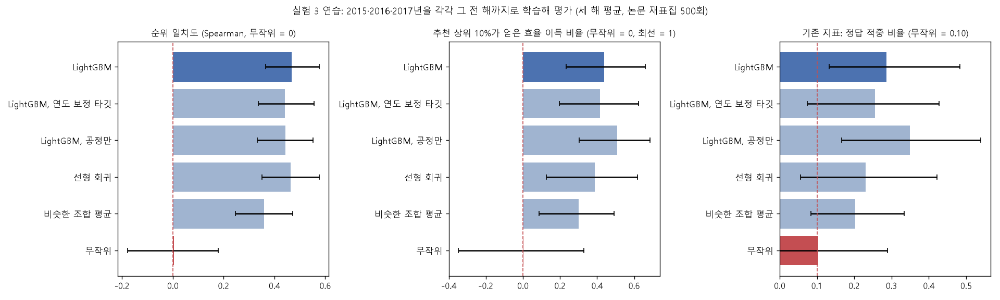

# 실험 3: "얼마나 가깝게 맞혔나"로 채점하기

**배경:** 실험 2는 정답 15개를 "맞혔다/틀렸다"로만 채점해서, 운과 실력을 구분하지 못했습니다. 실험 3은 **모든 후보 조합을 쓰고 부분 점수도 주는 채점법**으로 다시 평가합니다.

**진행 순서**
1. **1단계 (이번):** 2017년까지 데이터 안에서 연습합니다. 2018년 이후 데이터는 쓰지 않습니다.
2. **2단계:** 1단계 결과를 보고 주 지표·성공 기준을 정해 계획서를 먼저 커밋합니다.
3. **3단계:** 2018~2019년에 한 번만 적용합니다. 실험 2에서 한 번 쓴 데이터를 두 번째로 쓰는 것이라는 점을 밝힙니다.

> **정제 수정 (2026-10-05, 외부 검토 2차):** 이후 PCE 정합성 검사에 실제 광세기를 반영하고(PCE = 100×Voc×Jsc×FF/광세기), 일부 단계를 해석할 수 없는 어닐링 값을 결측으로 바꿨습니다. 정제 결과가 15,945행 → 15,943행으로 바뀝니다. 이 리포트의 숫자는 수정 전 정제로 계산했고, 2018년 이후 데이터를 쓰는 분석이라 다시 돌리지 않았습니다.

## 1단계: 과거 안에서 연습 (수정판, 2026-10-05)

**계획서:** [PLAN_phase1.md](../experiments/exp3/PLAN_phase1.md) (실행 전 커밋 `d96d6a2`, 처음 이름은 "실험 4")
**재현:** `python experiments/exp3/exp3_backtest.py` (약 9분) · **결과:** [results_backtest.md](../experiments/exp3/results_backtest.md) · 그림 [backtest_summary.png](../experiments/exp3/figures/backtest_summary.png)

> **성격:** 2017년까지 데이터만 쓰는 개발 단계 분석입니다. 방법 선택과 확인 평가의 계획에 쓰고, 최종 성능 주장에는 쓰지 않습니다.

> **처음 1단계(2026-10-04)와의 관계:** 처음 1단계는 하이퍼파라미터를 2017년까지 train 논문으로 미리 골라 썼습니다. 그래서 평가 연도의 일부를 이미 본 설정이었고, 방법도 같은 입력끼리 짝을 맞추지 않았습니다. 이 수정판으로 교체합니다(처음 버전은 커밋 `8b91ac4`에 남아 있음). 다만 처음 1단계에서 확인한 **"순위 일치도가 기존 정답 적중 지표보다 운과 실력을 약 3배 또렷하게 가른다"**(LightGBM−무작위 차이를 그 흔들림으로 나눈 값: 순위 일치도 4.3, 정답 적중 1.4)는 2단계 채점법을 정한 근거라서 기록으로 남깁니다.

### 왜 이 설계인가
외부 검토 2차에서 실험 1의 세 가지 문제가 확인됐습니다.
1. 튜닝 단계에 정답이 노출됐습니다.
2. 부트스트랩 안 교차검증에서 같은 논문이 양쪽에 들어갔습니다.
3. 입력 정보가 다른 방법끼리 비교했습니다.

재비교를 준비하다가 한 가지 문제를 더 찾았습니다. 실험 1처럼 같은 시기 안에서 정답만 숨기는 설계에서는 **정답이 아닌 후보가 학습 데이터에 남아 있어서**, 전체 후보 순위 지표가 부풀려집니다. 원래 데이터에서 순위 일치도가 0.77까지 나왔습니다.

그래서 **"그 전 해까지의 논문으로 학습 → 그해 논문의 조합 순위 맞히기"**로 바꿨습니다. 이 설계에서는 모든 후보가 처음 보는 데이터입니다. 튜닝도 학습 연도 안에서만 하므로 평가 연도가 노출되지 않습니다. 모델과 kNN 모두 과거 기록만 씁니다.

### 설계 요약

| 항목 | 내용 |
|---|---|
| 평가 연도 | 2015 (학습 770행·논문 173편), 2016 (2,296행·494편), 2017 (4,831행·1,031편) |
| 평가 후보 (고정) | 그해 조합 중 소자 3개 이상 + 논문 2편 이상: 51 / 58 / 79개 |
| 튜닝 | 학습 연도 안에서 논문 단위 GroupKFold(5), MAE 기준. LightGBM은 후보 4개 × 결측 처리 2방식, 선형 회귀는 alpha 4개 |
| 입력 | 실제 행 사용, 연도는 학습 마지막 연도로, 측정 방식은 Reverse로 고정 |
| 주 지표 | 순위 일치도(Spearman): 모델 점수 vs 조합의 실제 소자 평균 효율. 무작위 = 0 |
| 불확실성 | 연도마다 평가 논문 1,000회 재표집(후보 목록 고정, 모델 고정). 세 해는 같은 반복 번호끼리 평균 |
| 정제 | 2026-10-05 수정판 (광세기 반영, 해석 불가 어닐링 값은 결측) |

학습 연도마다 고른 설정은 다음과 같습니다.
- **2015년 평가분:** LightGBM 잎 63개 + 중앙값 결측 처리, 선형 회귀 alpha 100(전체)·10(공정+보정)
- **2016·2017년 평가분:** LightGBM 잎 15개 + 빈칸 그대로, 선형 회귀 alpha 10

### 결과 1: 모든 방법이 무작위보다 낫다

세 해 평균입니다. 표기는 "원래 데이터 점추정 [재표집 95% 구간]"이고, 재표집 평균은 따로 적었습니다.

| 방법 | 순위 일치도 | 재표집 평균 | 순위 일치도 (논문 평균 기준) | 추천 상위 10% 효율 이득 |
|---|---|---|---|---|
| **선형 회귀 (공정+보정)** | **0.49** [0.36, 0.53] | 0.45 | 0.56 [0.41, 0.57] | +2.4%p [1.9, 3.2] |
| LightGBM 10개 + 보너스 (전체) | 0.48 [0.36, 0.54] | 0.45 | 0.53 [0.39, 0.56] | +2.8%p [1.2, 3.1] |
| LightGBM 저효율 제외 (전체) | 0.47 [0.35, 0.52] | 0.43 | 0.49 [0.36, 0.53] | +1.9%p [0.5, 2.6] |
| 선형 회귀 (전체) | 0.47 [0.34, 0.51] | 0.42 | 0.51 [0.37, 0.53] | +1.7%p [0.7, 2.5] |
| LightGBM 10개 평균 (전체) | 0.46 [0.35, 0.53] | 0.44 | 0.50 [0.38, 0.55] | +2.3%p [1.0, 2.9] |
| LightGBM (공정+보정) | 0.44 [0.31, 0.47] | 0.39 | 0.48 [0.34, 0.50] | +2.4%p [1.4, 3.0] |
| LightGBM (전체) | 0.43 [0.32, 0.50] | 0.41 | 0.46 [0.34, 0.52] | +1.8%p [0.6, 2.6] |
| 비슷한 조합 평균 (kNN) | 0.36 [0.25, 0.43] | 0.34 | 0.44 [0.29, 0.46] | +1.8%p [1.0, 2.3] |
| 무작위 | 0 | | 0 | 0 |

- **이전 해 데이터로 다음 해 조합의 효율 순서를 무작위보다 확실히 맞힙니다.** 모든 방법의 구간 하한이 0.25 이상입니다. 논문별 평균으로 실제 효율을 바꿔도 결론은 같습니다.
- **원래 데이터 점추정이 재표집 구간의 위쪽 끝에 가깝게 놓입니다.** 재표집하면 각 조합의 실제 효율이 더 적은 논문으로 다시 계산되어 잡음이 커지고, 그만큼 순위 일치도가 낮아지기 때문입니다. 그래서 이 구간은 보수적인(낮은 쪽으로 치우친) 범위로 읽어야 합니다. 같은 재표집에서 계산하는 짝지은 차이는 이 영향을 덜 받습니다.

### 결과 2: 방법 간 우열은 판단할 증거가 부족하다

같은 재표집에서 짝지은 순위 일치도 차이입니다(세 해 평균).

| 질문 | 비교 | 차이 (점추정) | 95% 구간 | 판단 |
|---|---|---|---|---|
| 같은 공정 정보에서 비선형 모델이 필요한가 | LightGBM(공정+보정) − 선형 회귀(공정+보정) | −0.06 | −0.12 ~ +0.00 | 우열 판단 증거 부족 |
| 같은 공정 정보에서 모델이 비슷한 조합 평균보다 나은가 | LightGBM(공정+보정) − kNN | +0.07 | −0.02 ~ +0.12 | 우열 판단 증거 부족 |
| 소자 조건 정보가 도움이 되는가 (LightGBM) | 전체 − 공정+보정 | −0.01 | −0.05 ~ +0.11 | 우열 판단 증거 부족 |
| 소자 조건 정보가 도움이 되는가 (선형 회귀) | 전체 − 공정+보정 | −0.02 | −0.07 ~ +0.02 | 우열 판단 증거 부족 |
| 같은 전체 정보에서 비선형 모델이 필요한가 | LightGBM(전체) − 선형 회귀(전체) | −0.04 | −0.08 ~ +0.06 | 우열 판단 증거 부족 |
| 저효율 사례 제외가 도움이 되는가 | 저효율 제외 − LightGBM(전체) | +0.04 | −0.05 ~ +0.08 | 우열 판단 증거 부족 |
| 모델 10개 평균이 도움이 되는가 | 10개 평균 − LightGBM(전체) | +0.03 | −0.00 ~ +0.06 | 우열 판단 증거 부족 |
| 불확실성 보너스가 도움이 되는가 | 10개 + 보너스 − 10개 평균 | +0.02 | −0.02 ~ +0.03 | 우열 판단 증거 부족 |
| 실용 기준선 (정보량 다름) | LightGBM(전체) − kNN | +0.07 | −0.02 ~ +0.18 | 우열 판단 증거 부족 |

**읽는 법**
1. **복잡한 모델이 필요하다는 근거가 없습니다.** 같은 정보에서 LightGBM이 선형 회귀보다 낫다는 증거는 없고, 점추정은 오히려 선형 회귀가 높습니다(공정+보정: 0.49 vs 0.44).
2. **소자 조건 정보도 조합 순위에는 도움이 된다는 증거가 없습니다.** 소자 단위 효율 예측에서는 도움이 됐지만(실험 2), 조합끼리 순서를 매길 때는 공정+보정 정보만으로도 비슷합니다.
3. **모델이 "비슷한 레시피 평균"보다 낫다는 것도 이 개발 데이터에서는 확인되지 않았습니다.** 모든 모델의 점추정은 kNN(0.36)보다 높지만, 짝지은 구간이 0을 포함합니다. 실험 3 2단계(사후 분석)의 "LightGBM이 kNN보다 높음"은 이 시간 순서 개발 평가에서는 재현되지 않았습니다.
4. **저효율 제외, 앙상블, 불확실성 보너스는 모두 점추정이 약간 높은 방향**입니다(+0.02~+0.04). 하지만 증거로는 부족합니다.

### 결과 3: 해마다 차이가 크다

| 방법 | 2015 | 2016 | 2017 |
|---|---|---|---|
| LightGBM (전체) | 0.22 [0.06, 0.45] | 0.61 [0.46, 0.71] | 0.45 [0.26, 0.52] |
| LightGBM (공정+보정) | 0.39 [0.15, 0.50] | 0.58 [0.41, 0.66] | 0.34 [0.18, 0.44] |
| 선형 회귀 (전체) | 0.41 [0.21, 0.54] | 0.55 [0.39, 0.64] | 0.45 [0.25, 0.51] |
| 선형 회귀 (공정+보정) | 0.48 [0.25, 0.59] | 0.61 [0.44, 0.69] | 0.39 [0.25, 0.48] |
| 비슷한 조합 평균 (kNN) | 0.31 [0.10, 0.46] | 0.53 [0.37, 0.63] | 0.25 [0.11, 0.35] |

- **학습 데이터가 가장 적은 2015년(770행)에서는 LightGBM(전체)이 가장 약했습니다(0.22).** 데이터가 적을 때 복잡한 모델이 불안정하다는 일반적인 경향과 맞습니다.
- **방법 간 순위가 해마다 바뀝니다.** 한 해 결과만으로 방법을 고르면 안 된다는 뜻입니다.

### 결과 4: 소자 구성을 고정한 분석은 데이터가 부족했다

- **시도한 것:** 사용자가 소자 구성을 정한 상황을 흉내 내려고, 같은 소자 구성(구조·ETL·HTL·후면전극) 안에서 공정 조합의 순위를 매겼습니다.
- **결과:** 후보가 8개 이상인 구성이 해마다 1~2개뿐이었습니다. 순위 일치도는 0.15~0.34 수준이었지만 구간이 매우 넓어(예: 0.04~0.52) 해석할 수 없습니다.
- **의미:** **이 데이터의 세분도로는 "정해진 소자 구성 안에서 공정을 추천하는 성능"을 평가하기 어렵습니다.** 그 성능을 검증하려면 같은 구성에서 공정만 바꾼 데이터가 훨씬 더 필요합니다. 연구 질문을 좁힐 때 고려해야 할 제약입니다.

### 민감도와 한계
- **후보를 재표집마다 다시 정해도 같습니다.** 점추정과 구간이 고정 후보 평가와 거의 같습니다(results_compare.md의 spearman_rederived).
- **튜닝 기준은 MAE입니다.** 평가 지표(순위 일치도)와 다른 기준으로 고른 설정입니다.
- **변수 구성에는 전체 기간 EDA의 영향이 남아 있습니다.** 2018년 이후 데이터를 보고 정한 변수 구성이라는 노출 이력이 있습니다.
- **평가 연도가 세 해뿐이고, 후보가 해마다 51~79개입니다.** 방법 간 작은 차이(±0.05)를 가릴 검정력이 부족합니다.

### 다음 단계에 주는 의미
1. **주 방법은 단순한 모델로 충분해 보입니다.** 선형 회귀(공정+보정)가 점추정 최고이고 해마다 안정적이라, 확인 평가의 주 방법 후보로 올릴 만합니다. 다만 LightGBM보다 낫다는 증거도 없으므로 둘 다 사전에 정해 보고하는 것이 맞습니다.
2. **성능을 좌우하는 것은 모델보다 데이터입니다.** 모델 종류를 늘리기보다 변수의 정보량(빠진 공정 정보 확보, 문자열 정규화 등)을 개선하는 것이 우선입니다.
3. **"정해진 소자 구성에서 공정 추천"은 지금 데이터로 검증하기 어렵습니다.** 연구 질문은 "이후 문헌 조합의 효율 순위 예측"으로 두고, 소자 구성별 추천은 데이터를 확보한 뒤의 후속 과제로 두는 것이 현실적입니다.

## 2단계: 2018~2019년에 적용 (사후 분석, 2026-10-04)

> **이 분석은 2018~2019년 데이터를 두 번째로 쓰는 사후 분석이다. 실험 2의 판정(사전 기준 미달)을 대체하지 않는다. 채점법은 2017년 이전 데이터 안의 연습(1단계)으로 정했다.**

**계획서:** [PLAN_phase2.md](../experiments/exp3/PLAN_phase2.md). 실행 전에 커밋하고 GitHub에 올렸습니다(`705b888`).
**재현:** 원래 스크립트 `experiments/exp3/exp3_phase2.py`는 커밋 81577e4에 있습니다(약 1분). 수정 재실행은 이 절 끝.
**결과 파일:** [results_phase2.md](../experiments/exp3/results_phase2.md) · 그림 [phase2_summary.png](../experiments/exp3/figures/phase2_summary.png)

**재표집 확인:** 실험 2와 같은 시드로 같은 재표집 1,000개를 만들었습니다. 재표집마다 후보 수가 실험 2와 1,001/1,001 모두 같습니다(원래 데이터 1개 + 재표집 1,000개). **같은 재표집인데도** 실험 2의 채점법(정답 적중)으로는 판정 불가, 이번 채점법(순위 일치도)으로는 판정 가능했습니다.

### 판정

| 기준 | 원래 데이터 점추정 | 재표집 평균 (95% 구간) | 판정 |
|---|---|---|---|
| **주 기준:** LightGBM − kNN 순위 일치도 차이 하한 > 0 | — | **+0.16 (+0.05 ~ +0.27)**. 1,000번 중 1,000번 모두 LightGBM이 높음 | **충족** |
| 보조 1: LightGBM 순위 일치도 하한 > 0 | **0.44** | 0.42 (0.32 ~ 0.52) | 충족 |
| 보조 2: LightGBM 공정+보정 순위 일치도 하한 > 0 | 0.40 | 0.33 (0.21 ~ 0.44) | 충족 |
| 보조 3: 새 조합 45개만, LightGBM 순위 일치도 | 0.38 | 0.38 (0.08 ~ 0.65) | 하한 > 0 (참고) |
| 보조 3: 새 조합 45개만, LightGBM − kNN | — | +0.19 (−0.10 ~ +0.47) | 우열 판단 증거 부족 |
| 보조 4: 추천 상위 10% 조합의 실제 효율 − 후보 평균 | **+1.44%p** | +1.62%p (+0.37 ~ +2.78) | 무작위보다 높음 |

**읽는 법:** 발표·인용에는 **원래 데이터 점추정과 95% 구간**을 쓰고, 재표집 평균은 따로 표시합니다. 재표집 1,000번은 새 논문 1,000세트를 얻은 것이 아니라, 같은 1,421편을 다시 뽑아 흔들어 본 것입니다. 또 재표집마다 후보 조합 자체가 다시 정해지므로(복사된 논문 때문에 원래 자격이 없던 조합이 후보가 되기도 함), 이 구간은 "원래 146개 후보에 대한 불확실성"이 아니라 "후보 선정까지 포함한 불확실성"입니다.

**미리 정한 판정 문장:** "모델 순위가 비슷한 레시피 평균보다 실제 효율 순위와 더 잘 맞았다 (사후 분석)."

### 방법별 순위 일치도

| 방법 | 전체 후보 (146개) | 새 조합만 (45개) |
|---|---|---|
| **LightGBM** | **0.42** (0.32–0.52) | 0.38 (0.08–0.65) |
| 선형 회귀 | 0.40 (0.29–0.51) | 0.41 (0.11–0.64) |
| LightGBM, 공정+보정 | 0.33 (0.21–0.44) | 0.41 (0.11–0.68) |
| 비슷한 조합 평균 (kNN) | 0.26 (0.13–0.38) | 0.19 (−0.10–0.46) |

**짝지은 비교 (순위 일치도, 전체 후보)**

| 비교 | 평균 차이 | 95% 구간 | 판단 |
|---|---|---|---|
| LightGBM − kNN | +0.16 | +0.05 ~ +0.27 | LightGBM이 높음 |
| 선형 회귀 − kNN | +0.14 | +0.03 ~ +0.26 | 선형 회귀가 높음 |
| LightGBM 공정+보정 − kNN | +0.07 | −0.04 ~ +0.18 | 우열 판단 증거 부족 |
| 선형 회귀 − LightGBM | −0.02 | −0.10 ~ +0.07 | 우열 판단 증거 부족 |
| LightGBM 공정+보정 − LightGBM | −0.09 | −0.18 ~ −0.00 | 경계선 (상한이 0에 붙음) |

### 해석
1. **2018~2019년에 기록된 조합들의 효율 순서를 무작위보다 맞힙니다.** 순위 일치도는 원래 데이터 0.44(재표집 구간 0.32~0.52)입니다. 모델이 고른 상위 10% 조합은 후보 평균보다 실제 효율이 1.44%p 높았습니다(재표집 구간 +0.37~+2.78%p).
2. **이 비교는 "알고리즘의 우수성"을 보여주지 않습니다.** LightGBM은 공정과 소자 구성(HTL·ETL·구조 등)을 함께 쓰고, kNN은 공정만 씁니다. 같은 공정+보정 정보만 쓴 LightGBM과 kNN의 차이는 **우열을 판단할 증거가 부족**합니다(+0.07, −0.04~+0.18). 따라서 주 기준 충족은 "소자 구성까지 쓰는 모델이 공정만 보는 레시피 평균보다 순위를 잘 맞혔다"는 실용적 기준선 비교로만 해석합니다. 차이가 알고리즘 때문인지 추가 정보 때문인지는 구분되지 않습니다.
3. **새 조합 45개에서도 순서 신호가 보이지만, 새 공정 발견의 근거로 확대하면 안 됩니다.** 하한이 0.08로 0보다 크지만 구간이 넓고, kNN보다 낫다는 증거는 부족합니다.
4. **선형 회귀도 LightGBM과 비슷합니다.** 모델 종류보다 입력 정보가 성능을 좌우한다는 이전 결과와 같습니다.
5. **공정+보정 정보만으로도 순서 신호가 있습니다(0.33).** 소자 구성 정보를 함께 쓴 쪽이 높은 경향은 경계선입니다(상한이 0에 붙음).

### 한계 (리포트·발표 시 반드시 함께 적을 것)
- **사후 분석입니다.** 2018~2019년 데이터를 두 번째로 쓴 것이고, 채점법은 실험 2 결과를 본 뒤 바꿨습니다. 그 결정은 2017년까지 데이터의 연습 결과만 근거로 했지만, 사전 등록된 실험 2보다는 증거 수준이 낮습니다.
- **실험 2의 판정(사전 기준 미달)은 그대로입니다.** 이번 결과는 "채점법을 바꾸면 신호가 보인다"는 근거이지, 실험 2를 성공으로 바꾸는 근거가 아닙니다.
- **노출 이력이 남아 있습니다.** v2 변수 선택에는 2018~2019년 데이터가 쓰였습니다.
- **평가가 실제 추천 상황과 다릅니다.** 각 조합의 2018~2019년 **실제 소자 구성**을 입력에 넣고 점수를 매겼습니다. 실제 추천에서는 사용자가 소자 구성을 정하고 그 안에서 공정을 고르므로, 이번 결과는 "기록된 미래 사례에 점수를 매기는 성능"이지 "정해진 소자 구성에서 새 공정을 추천하는 성능"이 아닙니다.
- **실험 2 미달의 원인은 하나로 단정할 수 없습니다.** 표본 부족(정답 15개), 시기 변화(효율 수준 상승), 입력 정보 부족이 모두 가능한 원인입니다. "채점법을 바꾸니 신호가 보였다"는 것은 원인 중 하나를 시사할 뿐입니다.
- **조합 평균 방식:** 주 결과는 조합 안 소자 평균입니다. 소자를 많이 보고한 논문의 비중이 큽니다. 논문별 평균 기준 결과는 실험 3에서 계산하지 않았습니다(후속 과제).
- **"공정+보정" 이름:** 이 리포트의 "공정+보정"은 공정 변수 7개 + 보정 변수 2개(연도·측정 스캔 방향, 예측 때는 고정)입니다. 실험 1 잡음 한계의 "공정 변수만"(7개)과 다릅니다.
- **확증하려면 개발에 쓰지 않은 데이터가 필요합니다.** 2018~2020년 데이터는 모두 EDA나 v2 개발에 쓰였으므로, 2020년을 새 평가 연도로 정한다고 미사용 데이터가 되지 않습니다. 현재 모델링에 한 번도 쓰지 않은 자료는 LLM 추출 데이터(8,532행)뿐이며, 품질 검증이 먼저 필요합니다.

### 2단계 사후 수정 재실행 (2026-10-05)

> **사후 수정 재실행:** 2018~2019년 데이터를 세 번째로 쓴 분석이라 확인적 증거가 아닙니다. 실험 2의 사전 판정(미달)은 그대로입니다.

**계획:** [PLAN_corrected_reruns.md](../experiments/PLAN_corrected_reruns.md) (실행 전 커밋 f40342e) · **재현:** `python experiments/exp2/exp2_corrected.py` (실험 2와 같은 모델·재표집, 약 10분) · **결과:** [results_phase2_corrected.md](../experiments/exp3/results_phase2_corrected.md)

**고친 것:** 튜닝을 2017년까지 데이터 안에서만 하고, 같은 입력 정보끼리 비교(LightGBM·선형 회귀의 공정+보정 − kNN)를 추가했습니다.

| 방법 | 순위 일치도 (소자 평균) | 논문 평균 기준 | 새 조합 45개만 |
|---|---|---|---|
| LightGBM (전체) | 0.44 [0.29, 0.53] | 0.47 [0.34, 0.57] | 0.37 [0.05, 0.63] |
| LightGBM (공정+보정) | 0.37 [0.18, 0.43] | 0.42 [0.23, 0.47] | 0.42 [0.03, 0.62] |
| 선형 회귀 (전체) | 0.39 [0.27, 0.51] | 0.46 [0.34, 0.58] | 0.40 [0.08, 0.63] |
| 선형 회귀 (공정+보정) | 0.35 [0.19, 0.45] | 0.43 [0.29, 0.52] | 0.40 [0.02, 0.65] |
| 비슷한 조합 평균 (kNN) | 0.29 [0.13, 0.38] | 0.36 [0.20, 0.45] | 0.26 [−0.10, 0.45] |
| LightGBM 10개 + 보너스 (전체) | 0.48 [0.34, 0.57] | 0.51 [0.36, 0.60] | 0.45 [0.12, 0.66] |

| 짝지은 비교 (순위 일치도) | 차이 [95% 구간] | 판단 |
|---|---|---|
| LightGBM (전체) − kNN (원래 주 기준, 정보량 다름) | +0.15 [+0.05, +0.27] | 앞이 높음 |
| LightGBM (공정+보정) − kNN (같은 정보) | +0.08 [−0.05, +0.16] | 우열 판단 증거 부족 |
| 선형 회귀 (공정+보정) − kNN (같은 정보) | +0.06 [−0.03, +0.18] | 우열 판단 증거 부족 |
| LightGBM (공정+보정) − 선형 회귀 (공정+보정) | +0.02 [−0.11, +0.08] | 우열 판단 증거 부족 |
| LightGBM (전체) − LightGBM (공정+보정) | +0.07 [+0.02, +0.20] | 앞이 높음 |

**해석:** 원래 2단계의 "LightGBM이 kNN보다 높음"은 수정 후에도 나오지만, **같은 공정 정보만 주면 우열을 판단할 증거가 부족합니다.** 차이는 모델 종류보다 **소자 조건 정보**(구조·수송층·전극 등)에서 온다고 보는 것이 맞고, 1단계(시간 순서 개발 평가)와 같은 그림입니다. 새 조합만 보면 모든 비교가 우열 판단 증거 부족입니다.

