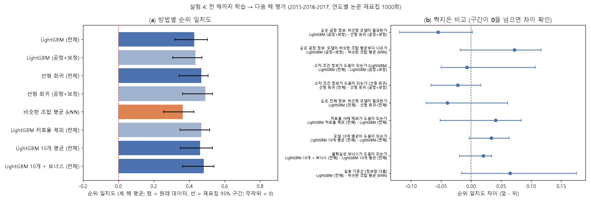

# 실험 4: 같은 입력·같은 기준으로 방법 재비교 (개발 데이터, 시간 순서 평가)

**계획서:** [experiments/exp4/PLAN.md](../experiments/exp4/PLAN.md). 실행 전에 커밋했습니다(`d96d6a2`).
**재현:** `python experiments/exp4/exp4_compare.py` (약 9분)
**결과 파일:** [results_compare.md](../experiments/exp4/results_compare.md) · 그림 [compare_summary.png](../experiments/exp4/figures/compare_summary.png)

> **성격:** 2017년까지 데이터만 쓰는 **개발 단계 분석**입니다. 방법 선택과 다음 확인 평가의 계획에 쓰고, 최종 성능 주장에는 쓰지 않습니다. 실험 1의 기존 수치(튜닝 노출 있음)를 대신하는 방법 비교입니다.

## 왜 이 설계인가
외부 검토 2차에서 실험 1의 세 가지 문제가 확인됐습니다.
1. 튜닝 단계에 정답이 노출됐습니다.
2. 부트스트랩 안 교차검증에서 같은 논문이 양쪽에 들어갔습니다.
3. 입력 정보가 다른 방법끼리 비교했습니다.

재비교를 준비하다가 한 가지 문제를 더 찾았습니다. 실험 1처럼 같은 시기 안에서 정답만 숨기는 설계에서는 **정답이 아닌 후보가 학습 데이터에 남아 있어서**, 전체 후보 순위 지표가 부풀려집니다. 원래 데이터에서 순위 일치도가 0.77까지 나왔습니다.

그래서 **"그 전 해까지의 논문으로 학습 → 그해 논문의 조합 순위 맞히기"**로 바꿨습니다. 이 설계에서는 모든 후보가 처음 보는 데이터입니다. 튜닝도 학습 연도 안에서만 하므로 평가 연도가 노출되지 않습니다. 모델과 kNN 모두 과거 기록만 씁니다.

## 설계 요약

| 항목 | 내용 |
|---|---|
| 평가 연도 | 2015 (학습 770행·논문 173편), 2016 (2,296행·494편), 2017 (4,831행·1,031편) |
| 평가 후보 (고정) | 그해 조합 중 소자 3개 이상 + 논문 2편 이상: 51 / 58 / 79개 |
| 튜닝 | 학습 연도 안에서 논문 단위 GroupKFold(5), MAE 기준. LightGBM은 후보 4개 × 결측 처리 2방식, 선형 회귀는 alpha 4개 |
| 입력 | 실제 행 사용, 연도는 학습 마지막 연도로, 측정 방식은 Reverse로 고정 |
| 주 지표 | 순위 일치도(Spearman): 모델 점수 vs 조합의 실제 소자 평균 효율. 무작위 = 0 |
| 불확실성 | 연도마다 평가 논문 1,000회 재표집(후보 목록 고정, 모델 고정). 세 해는 같은 반복 번호끼리 평균 |
| 정제 | 2026-10-05 수정판 (광세기 반영, 해석 불가 어닐링 값은 결측) |

학습 연도마다 고른 설정은 다음과 같습니다.
- **2015년 평가분:** LightGBM 잎 63개 + 중앙값 결측 처리, 선형 회귀 alpha 100(전체)·10(공정+보정)
- **2016·2017년 평가분:** LightGBM 잎 15개 + 빈칸 그대로, 선형 회귀 alpha 10

## 결과 1: 모든 방법이 무작위보다 낫다

세 해 평균입니다. 표기는 "원래 데이터 점추정 [재표집 95% 구간]"이고, 재표집 평균은 따로 적었습니다.

| 방법 | 순위 일치도 | 재표집 평균 | 순위 일치도 (논문 평균 기준) | 추천 상위 10% 효율 이득 |
|---|---|---|---|---|
| **선형 회귀 (공정+보정)** | **0.49** [0.36, 0.53] | 0.45 | 0.56 [0.41, 0.57] | +2.4%p [1.9, 3.2] |
| LightGBM 10개 + 보너스 (전체) | 0.48 [0.36, 0.54] | 0.45 | 0.53 [0.39, 0.56] | +2.8%p [1.2, 3.1] |
| LightGBM 저효율 제외 (전체) | 0.47 [0.35, 0.52] | 0.43 | 0.49 [0.36, 0.53] | +1.9%p [0.5, 2.6] |
| 선형 회귀 (전체) | 0.47 [0.34, 0.51] | 0.42 | 0.51 [0.37, 0.53] | +1.7%p [0.7, 2.5] |
| LightGBM 10개 평균 (전체) | 0.46 [0.35, 0.53] | 0.44 | 0.50 [0.38, 0.55] | +2.3%p [1.0, 2.9] |
| LightGBM (공정+보정) | 0.44 [0.31, 0.47] | 0.39 | 0.48 [0.34, 0.50] | +2.4%p [1.4, 3.0] |
| LightGBM (전체) | 0.43 [0.32, 0.50] | 0.41 | 0.46 [0.34, 0.52] | +1.8%p [0.6, 2.6] |
| 비슷한 조합 평균 (kNN) | 0.36 [0.25, 0.43] | 0.34 | 0.44 [0.29, 0.46] | +1.8%p [1.0, 2.3] |
| 무작위 | 0 | | 0 | 0 |

- **이전 해 데이터로 다음 해 조합의 효율 순서를 무작위보다 확실히 맞힙니다.** 모든 방법의 구간 하한이 0.25 이상입니다. 논문별 평균으로 실제 효율을 바꿔도 결론은 같습니다.
- **원래 데이터 점추정이 재표집 구간의 위쪽 끝에 가깝게 놓입니다.** 재표집하면 각 조합의 실제 효율이 더 적은 논문으로 다시 계산되어 잡음이 커지고, 그만큼 순위 일치도가 낮아지기 때문입니다. 그래서 이 구간은 보수적인(낮은 쪽으로 치우친) 범위로 읽어야 합니다. 같은 재표집에서 계산하는 짝지은 차이는 이 영향을 덜 받습니다.

## 결과 2: 방법 간 우열은 판단할 증거가 부족하다

같은 재표집에서 짝지은 순위 일치도 차이입니다(세 해 평균).

| 질문 | 비교 | 차이 (점추정) | 95% 구간 | 판단 |
|---|---|---|---|---|
| 같은 공정 정보에서 비선형 모델이 필요한가 | LightGBM(공정+보정) − 선형 회귀(공정+보정) | −0.06 | −0.12 ~ +0.00 | 우열 판단 증거 부족 |
| 같은 공정 정보에서 모델이 비슷한 조합 평균보다 나은가 | LightGBM(공정+보정) − kNN | +0.07 | −0.02 ~ +0.12 | 우열 판단 증거 부족 |
| 소자 조건 정보가 도움이 되는가 (LightGBM) | 전체 − 공정+보정 | −0.01 | −0.05 ~ +0.11 | 우열 판단 증거 부족 |
| 소자 조건 정보가 도움이 되는가 (선형 회귀) | 전체 − 공정+보정 | −0.02 | −0.07 ~ +0.02 | 우열 판단 증거 부족 |
| 같은 전체 정보에서 비선형 모델이 필요한가 | LightGBM(전체) − 선형 회귀(전체) | −0.04 | −0.08 ~ +0.06 | 우열 판단 증거 부족 |
| 저효율 사례 제외가 도움이 되는가 | 저효율 제외 − LightGBM(전체) | +0.04 | −0.05 ~ +0.08 | 우열 판단 증거 부족 |
| 모델 10개 평균이 도움이 되는가 | 10개 평균 − LightGBM(전체) | +0.03 | −0.00 ~ +0.06 | 우열 판단 증거 부족 |
| 불확실성 보너스가 도움이 되는가 | 10개 + 보너스 − 10개 평균 | +0.02 | −0.02 ~ +0.03 | 우열 판단 증거 부족 |
| 실용 기준선 (정보량 다름) | LightGBM(전체) − kNN | +0.07 | −0.02 ~ +0.18 | 우열 판단 증거 부족 |

**읽는 법**
1. **복잡한 모델이 필요하다는 근거가 없습니다.** 같은 정보에서 LightGBM이 선형 회귀보다 낫다는 증거는 없고, 점추정은 오히려 선형 회귀가 높습니다(공정+보정: 0.49 vs 0.44).
2. **소자 조건 정보도 조합 순위에는 도움이 된다는 증거가 없습니다.** 소자 단위 효율 예측에서는 도움이 됐지만(실험 2), 조합끼리 순서를 매길 때는 공정+보정 정보만으로도 비슷합니다.
3. **모델이 "비슷한 레시피 평균"보다 낫다는 것도 이 개발 데이터에서는 확인되지 않았습니다.** 모든 모델의 점추정은 kNN(0.36)보다 높지만, 짝지은 구간이 0을 포함합니다. 실험 3 2단계(사후 분석)의 "LightGBM이 kNN보다 높음"은 이 시간 순서 개발 평가에서는 재현되지 않았습니다.
4. **저효율 제외, 앙상블, 불확실성 보너스는 모두 점추정이 약간 높은 방향**입니다(+0.02~+0.04). 하지만 증거로는 부족합니다.

## 결과 3: 해마다 차이가 크다

| 방법 | 2015 | 2016 | 2017 |
|---|---|---|---|
| LightGBM (전체) | 0.22 [0.06, 0.45] | 0.61 [0.46, 0.71] | 0.45 [0.26, 0.52] |
| LightGBM (공정+보정) | 0.39 [0.15, 0.50] | 0.58 [0.41, 0.66] | 0.34 [0.18, 0.44] |
| 선형 회귀 (전체) | 0.41 [0.21, 0.54] | 0.55 [0.39, 0.64] | 0.45 [0.25, 0.51] |
| 선형 회귀 (공정+보정) | 0.48 [0.25, 0.59] | 0.61 [0.44, 0.69] | 0.39 [0.25, 0.48] |
| 비슷한 조합 평균 (kNN) | 0.31 [0.10, 0.46] | 0.53 [0.37, 0.63] | 0.25 [0.11, 0.35] |

- **학습 데이터가 가장 적은 2015년(770행)에서는 LightGBM(전체)이 가장 약했습니다(0.22).** 데이터가 적을 때 복잡한 모델이 불안정하다는 일반적인 경향과 맞습니다.
- **방법 간 순위가 해마다 바뀝니다.** 한 해 결과만으로 방법을 고르면 안 된다는 뜻입니다.

## 결과 4: 소자 구성을 고정한 분석은 데이터가 부족했다

- **시도한 것:** 사용자가 소자 구성을 정한 상황을 흉내 내려고, 같은 소자 구성(구조·ETL·HTL·후면전극) 안에서 공정 조합의 순위를 매겼습니다.
- **결과:** 후보가 8개 이상인 구성이 해마다 1~2개뿐이었습니다. 순위 일치도는 0.15~0.34 수준이었지만 구간이 매우 넓어(예: 0.04~0.52) 해석할 수 없습니다.
- **의미:** **이 데이터의 세분도로는 "정해진 소자 구성 안에서 공정을 추천하는 성능"을 평가하기 어렵습니다.** 그 성능을 검증하려면 같은 구성에서 공정만 바꾼 데이터가 훨씬 더 필요합니다. 연구 질문을 좁힐 때 고려해야 할 제약입니다.

## 민감도와 한계
- **후보를 재표집마다 다시 정해도 같습니다.** 점추정과 구간이 고정 후보 평가와 거의 같습니다(results_compare.md의 spearman_rederived).
- **튜닝 기준은 MAE입니다.** 평가 지표(순위 일치도)와 다른 기준으로 고른 설정입니다.
- **변수 구성에는 전체 기간 EDA의 영향이 남아 있습니다.** 2018년 이후 데이터를 보고 정한 변수 구성이라는 노출 이력이 있습니다.
- **평가 연도가 세 해뿐이고, 후보가 해마다 51~79개입니다.** 방법 간 작은 차이(±0.05)를 가릴 검정력이 부족합니다.

## 다음 단계에 주는 의미
1. **주 방법은 단순한 모델로 충분해 보입니다.** 선형 회귀(공정+보정)가 점추정 최고이고 해마다 안정적이라, 확인 평가의 주 방법 후보로 올릴 만합니다. 다만 LightGBM보다 낫다는 증거도 없으므로 둘 다 사전에 정해 보고하는 것이 맞습니다.
2. **성능을 좌우하는 것은 모델보다 데이터입니다.** 모델 종류를 늘리기보다 변수의 정보량(빠진 공정 정보 확보, 문자열 정규화 등)을 개선하는 것이 우선입니다.
3. **"정해진 소자 구성에서 공정 추천"은 지금 데이터로 검증하기 어렵습니다.** 연구 질문은 "이후 문헌 조합의 효율 순위 예측"으로 두고, 소자 구성별 추천은 데이터를 확보한 뒤의 후속 과제로 두는 것이 현실적입니다.
