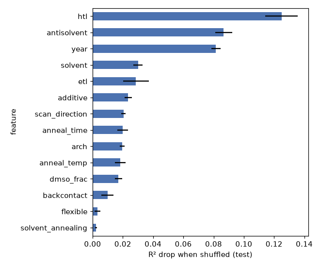
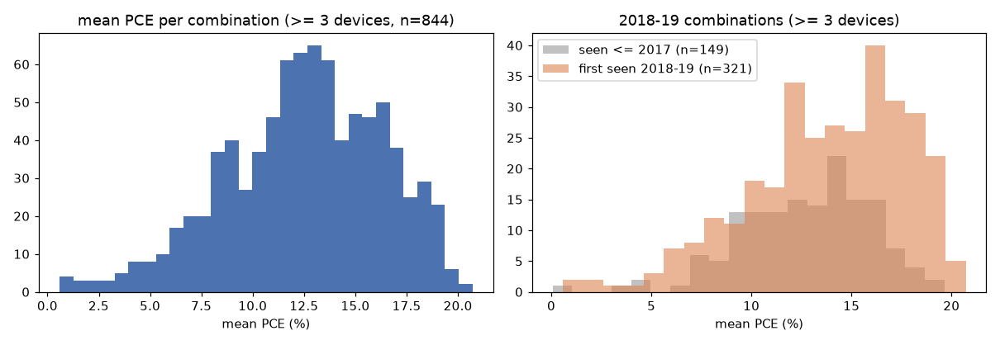
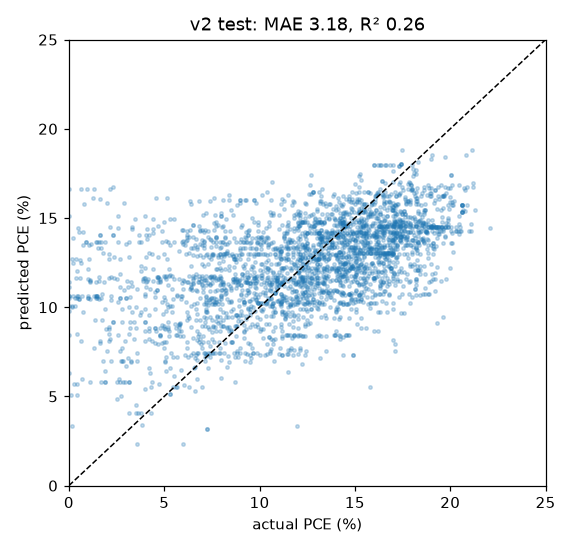
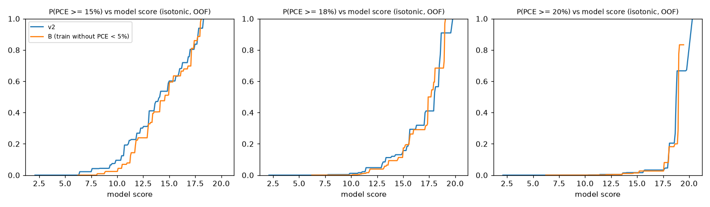

# v2: 공정 조건 → PCE 예측 모델

**역할:** 최종 목표("목표 PCE → 공정 조건 역추천") 안에 들어갈 예측 모델이며, 실험 1·2의 비교 기준선이자 부품입니다.
**재현:** `python models/v2/model_v2.py` (교차검증 결과는 `models/v2/cache/`에 저장되어 다시 실행하면 이어서 진행)
**설정:** [config/v2.py](../config/v2.py) · **전체 표:** [models/v2/results.md](../models/v2/results.md) · **최종 설정:** [models/v2/best_params.json](../models/v2/best_params.json)
**분할:** 논문별 train/test 역할은 [splits/doi_split.csv](../splits/doi_split.csv)에 저장되어 있고, v2·EDA·실험 1이 모두 이 파일을 씁니다(`python splits/make_split.py`로 생성). v2 논문의 역할은 기존 분할과 같아서 아래 숫자는 그대로 유효합니다.

> **데이터 노출 이력 (외부 검토 반영, 2026-10-02):** v2를 개발하는 동안 2018년 이후 논문이 학습·튜닝에 포함됐습니다. 하이퍼파라미터 선택(train 교차검증), 변수 선택에 참고한 EDA, 아래 진단·도달 확률 표가 모두 2018~2020년 데이터를 썼습니다. 그래서 `best_params.json`과 이 리포트의 숫자는 **2018년 이후 데이터에 대해 독립적인 평가가 아닙니다.** 실험 1·2에는 2017년까지 train 논문만으로 다시 고른 [best_params_past.json](../models/v2/best_params_past.json)을 씁니다(`python models/v2/tune_past.py`). 다만 변수 구성과 후보값 격자는 전체 기간 EDA를 보고 정한 것이라, 그 영향까지 완전히 없앤 것은 아닙니다.

## 요약

- **test 점수:** MAE **3.18%p**, R² **0.26**입니다. v1(MAE 3.50, R² 0.14)보다 R²가 약 2배입니다. 같은 test 행에서 비교하면 v1 0.08, v2 0.26입니다.
- **변수 그룹별 기여:** 공정 변수만으로는 R² 0.15로 v1 수준입니다. 조건 변수(구조·ETL·HTL 등)를 더하면 0.21, 보정 변수(연도·스캔 방향)까지 더하면 0.26이 됩니다.
- **중요 변수:** 상위는 HTL, 반용매, 연도 순입니다. 공정 변수 중에서는 반용매가 가장 중요하고 그다음이 용매입니다.
- **Cl 첨가제:** PCE가 낮아 보이는 것은 Cl 자체보다 교란 때문일 가능성이 큽니다. Cl을 쓴 논문은 더 오래됐고, 어닐링이 길고, 반용매를 덜 썼습니다. 반용매나 연도를 맞추면 차이가 거의 사라집니다(관측 자료라 인과는 확인 불가).
- **실험 1·2용 데이터:** 소자가 3개 이상인 공정 조합은 844개입니다. 2018~2019년 조합 905개 중 707개(78%)가 2017년까지는 없던 새 조합입니다.

## 1. 정제

| 단계 | 남은 행 | 논문 | 비고 |
|---|---|---|---|
| NOMAD 전체 | 51,640 | 10,250 | |
| MAPbI3 + one-step 스핀코팅 | 17,866 | 3,496 | |
| LLM 추출 행 제외 | 17,365 | 3,269 | |
| 1 sun 아닌(실내광) 측정 제외 | 17,229 | 3,255 | 광세기 90~110 mW/cm²만 |
| PCE 결측 또는 0 이하 제거 | 16,875 | 3,240 | |
| 완전 중복 제거 | 16,800 | 3,240 | 행마다 다른 ID 컬럼 4개를 뺀 나머지가 같은 행 75개 |
| FF % 단위 수정 | 16,800 | 3,240 | 6행을 /100 |
| abs(Voc×Jsc×FF − PCE) > 1%p 제외 | 16,017 | 3,183 | 검사할 수 없는 647행은 남김 |
| DOI 결측 제거 | **15,945** | **3,183** | 논문 단위 분할에 필요 |

- **단계적 어닐링:** `65; 100`처럼 적힌 2,108행을 최고 온도와 총 시간으로 바꿔 살렸습니다. 어닐링 온도 결측률이 EDA 때 21.6%에서 8.4%로 줄었습니다.
- **분할:** DOI 단위로 train 12,927행(논문 2,546편), test 3,018행(637편)입니다. 같은 논문은 양쪽에 섞이지 않습니다.

## 2. 변수와 결측 처리

| 그룹 | 변수 | 처리 |
|---|---|---|
| 공정 (추천 대상) | 용매 종류, dmso_frac, 반용매, 어닐링 온도, 어닐링 시간, 첨가제, solvent annealing 여부 | 반용매는 `none_or_unreported` 범주를 유지. 첨가제는 상위 5종 + `Undoped` + 기록없음 + other |
| 조건 (임시) | 소자 구조, 후면전극, 유연 기판 여부, ETL, HTL | ETL·HTL은 상위 6개, 후면전극은 상위 5개 + other |
| 보정 | 출판 연도, 스캔 방향 | 추천할 때는 2019년, Reverse로 고정 (config `PREDICT_AT`) |
| 제외 | 두께, 제조 분위기, 상대습도, 전구체 농도, Voc/Jsc/FF, 히스테리시스 지수 | |

- **상위 범주 기준:** 상위 N개 범주는 **train 행으로만** 정했습니다.
- **범주형 결측:** 항상 `missing` 범주로 넣었습니다.
- **숫자형 결측:** 두 방식을 비교했습니다. (A) 중앙값으로 채우고 결측 여부 칸을 추가하는 방식, (B) 빈칸을 그대로 모델에 넣는 방식입니다.
- **결측 비율:** 첨가제 64.4%(기록없음), 어닐링 시간 10.6%, 어닐링 온도 8.4%, dmso_frac 6.3%, 용매 3.2%이고, 나머지 변수는 1% 미만입니다.

## 3. 모델 비교와 튜닝

- **교차검증:** train 안에서만 GroupKFold(5, DOI 단위)로 했습니다.
- **비교 범위:** 모델 3종 × 결측 처리 2방식 × 하이퍼파라미터 4개로 24개 조합을 돌렸습니다.
- **2018~2019년:** 실험 2에 쓸 수 있도록, 튜닝 중에는 이 기간을 따로 떼어 점수를 보지 않았습니다.

| 모델 | 결측 처리 | 교차검증 최적 설정 | 교차검증 MAE | 교차검증 R² | test MAE | test R² |
|---|---|---|---|---|---|---|
| train 평균 | | | | | 3.91 | 0.00 |
| RandomForest | 중앙값+결측 표시 | min_samples_leaf 5, max_features 0.33 | 3.181 | 0.231 | 3.25 | 0.25 |
| **LightGBM** ← 선택 | **빈칸 그대로** | num_leaves 15, 300 trees, lr 0.05 | **3.093** | **0.267** | 3.18 | 0.26 |
| HistGradientBoosting | 중앙값+결측 표시 | max_leaf_nodes 15, lr 0.05, 300 iter | 3.102 | 0.266 | 3.17 | 0.26 |

- **선택 기준:** 교차검증 MAE가 가장 낮은 LightGBM을 골랐습니다. test 점수로는 고르지 않았습니다.
- **결측 처리:** 두 방식의 차이가 교차검증 MAE 기준 0.01 이내라, 우열을 판단할 증거가 부족합니다.
- **모델 크기:** 세 모델 모두 작은 트리(잎 15개)가 더 좋았습니다. 데이터에 잡음이 많아서 큰 모델은 과적합되는 것으로 보입니다.

**v1과 같은 test 행에서 비교:** v1은 숫자로 바뀌지 않는 어닐링 값을 버리므로, v1이 쓸 수 있는 test 행(2,346행)만 골라 같은 조건에서 비교했습니다.

| 모델 | test 행 | MAE | R² |
|---|---|---|---|
| v1 설정 (변수 4개, HGB 기본값) | 2,346 | 3.67 | 0.08 |
| v2 | 2,346 | 3.23 | 0.26 |
| v2 (test 전체) | 3,018 | 3.18 | 0.26 |

## 평가 1. 변수 그룹을 하나씩 추가할 때

| 변수 | 개수 | 교차검증 MAE | 교차검증 R² | test MAE | test R² |
|---|---|---|---|---|---|
| 공정 | 7 | 3.43 | 0.13 | 3.47 | 0.15 |
| 공정 + 조건 | 12 | 3.17 | 0.23 | 3.28 | 0.21 |
| 공정 + 조건 + 보정 | 14 | 3.09 | 0.27 | 3.18 | 0.26 |

- **공정 변수만의 설명력:** R² 0.13~0.15로, 공정 변수만으로는 PCE의 일부만 설명됩니다. 역추천 결과의 신뢰도에 직접 영향을 주는 수치입니다.
- **조건 변수 추가 효과:** R²가 가장 크게 오릅니다(+0.08). 같은 공정이라도 어떤 소자 구조에 쓰였는지가 효율에 크게 작용한다는 뜻입니다.

## 평가 2. 민감도: 반용매·첨가제가 명시된 행만으로 학습

| 모델 | train 행 | test 행 (명시된 행만) | MAE | R² |
|---|---|---|---|---|
| 전체 데이터로 학습 | 12,927 | 423 | 3.16 | 0.16 |
| 명시된 행만으로 학습 | 1,645 | 423 | 3.30 | 0.10 |

- **조건:** 반용매가 `none_or_unreported`가 아니고, 첨가제가 기록된(`Undoped` 포함) 행만 썼습니다. train의 13%만 남습니다.
- **결과:** 같은 test 행에서도 전체 데이터로 학습한 모델이 낫습니다. "기록없음" 범주를 그대로 두고 전체 데이터를 쓰는 현재 방식을 유지합니다.

## 평가 3. 변수 중요도 (permutation, test, 5회 반복)

| 순위 | 변수 | 그룹 | R² 감소 | MAE 증가 (%p) |
|---|---|---|---|---|
| 1 | HTL | 조건 | 0.125 | 0.31 |
| 2 | 반용매 | 공정 | 0.087 | 0.22 |
| 3 | 출판 연도 | 보정 | 0.082 | 0.19 |
| 4 | 용매 | 공정 | 0.030 | 0.10 |
| 5 | ETL | 조건 | 0.029 | 0.10 |
| 6 | 첨가제 | 공정 | 0.023 | 0.07 |
| 7 | 스캔 방향 | 보정 | 0.020 | 0.06 |
| 8 | 어닐링 시간 | 공정 | 0.020 | 0.06 |
| 9 | 소자 구조 | 조건 | 0.019 | 0.06 |
| 10 | 어닐링 온도 | 공정 | 0.018 | 0.05 |
| 11 | dmso_frac | 공정 | 0.017 | 0.06 |
| 12 | 후면전극 | 조건 | 0.010 | 0.04 |
| 13 | 유연 기판 | 조건 | 0.003 | 0.01 |
| 14 | solvent annealing | 공정 | 0.002 | 0.01 |

변수가 14개라 상위 15개를 요청하셨지만 전부 표시했습니다. 어닐링 온도는 10위이고, 정하신 대로 중요도와 관계없이 추천 변수로 유지합니다. solvent annealing은 True가 2.5%뿐이라 중요도가 낮게 나옵니다.

## 평가 4. 오류 분석: 예측 오차가 큰 상위 20개 조합

조합은 공정 변수 7개를 구간으로 묶어 정의했습니다(6절과 같은 기준). test에서 소자 3개 이상인 조합만 봤습니다. 상위 5개는 다음과 같습니다(전체 20개는 results.md).

| 조합 (용매 / DMSO 구간 / 반용매 / 첨가제 / SA / 온도 / 시간) | 소자 | 논문 | 실제 | 예측 |
|---|---|---|---|---|
| DMSO;NMP / 0–0.35 / gas / 기록없음 / 1 / 100 / 0 | 5 | 1 | 1.0 | 16.6 |
| DMF;DMSO / 0–0.35 / 미사용 / Hydrazine / 0 / 100 / 20 | 5 | 1 | 1.2 | 14.2 |
| DMF;DMSO / 0–0.35 / Chlorobenzene / NaI / 0 / 100 / 40 | 3 | 1 | 5.8 | 16.1 |
| DMF;THF / 0 / 미사용 / MEH-PPV;TBP / 0 / 100 / 15 | 12 | 1 | 1.6 | 10.5 |
| DMSO / 0.9–1 / Diethyl ether / 기록없음 / 0 / 60 / 0 | 13 | 1 | 1.7 | 10.6 |

**공통점**
1. **논문 한 편짜리 조합입니다.** 20개 중 19개가 논문 1편에서만 나왔습니다. 그 논문의 실험 조건이나 실패 사례를 모델이 알 방법이 없습니다.
2. **효율이 매우 낮은 소자를 과대 예측합니다.** 이 조합들의 실제 평균은 7.6%, 예측 평균은 12.9%입니다. 실제 PCE가 5% 미만인 행이 41%로, test 전체(9%)보다 훨씬 많습니다. 논문 속 대조군이나 실패 조건으로 보입니다.
3. **드문 용매·첨가제가 많습니다.** DMSO 단독(test 전체 4% → 15%), NMP, THF, 그리고 상위 5종에 들지 않은 첨가제(MEH-PPV, PVDF-HFP, Hydrazine 등)입니다. 이런 첨가제는 모두 "other"로 묶여 모델이 구분하지 못합니다.
4. **연도와 스캔 방향은 test 전체와 비슷합니다.** 오차가 큰 원인은 보정 변수 쪽이 아닙니다.

**역추천에 주는 시사점:** 논문 수가 적은 조합은 예측을 믿기 어렵습니다. 추천 결과에는 근거 논문 수를 함께 보여주고, 논문 2편 이상인 조합만 추천하는 규칙이 필요합니다.

## 평가 5. Cl 첨가제 확인 (train)

| 그룹 | 행 | PCE 중앙값 | 어닐링 시간 중앙값 | 30분 이상 비율 | 반용매 사용 비율 | 연도 중앙값 | 2015년 이하 비율 |
|---|---|---|---|---|---|---|---|
| Cl | 2,391 | 11.3 | 50분 | 62% | 22% | 2016 | 32% |
| 첨가제 기록없음 | 8,354 | 13.3 | 10분 | 18% | 75% | 2018 | 11% |

- **어닐링 시간 분포:** Cl은 사분위가 20 / 50 / 90분이고, 기록없음은 10 / 10 / 20분입니다. Cl은 초기 MAPbI3-xClx 계열 공정처럼 어닐링을 길게 했습니다.

**조건을 맞춘 PCE 중앙값 비교**

| 비교 조건 | Cl | 기록없음 |
|---|---|---|
| 전체 | 11.3 | 13.3 |
| 어닐링 30분 이상 | 11.0 (n=1,476) | 13.4 (n=1,504) |
| 어닐링 30분 이상 + 반용매 미사용 | **10.8** (n=1,363) | **10.2** (n=500) |
| 어닐링 30분 이상 + 2014~2016년 | **10.6** (n=863) | **10.9** (n=409) |

- **어닐링 시간만 맞춘 경우:** Cl이 여전히 2.4%p 낮습니다.
- **반용매나 연도까지 맞춘 경우:** 차이가 −0.3 ~ +0.6%p로 사라집니다.
- **결론:** Cl의 낮은 PCE는 첨가제 효과보다, 반용매를 쓰지 않던 시기의 공정이라는 교란에서 나왔을 가능성이 큽니다. 관측 자료라 남은 교란 요인을 배제할 수 없습니다. 모델은 연도와 반용매를 함께 보므로 이 교란을 일부 보정합니다. 다만 역추천에서 "Cl을 피하라"는 추천이 나오더라도 근거로 쓰면 안 됩니다.

## 평가 6. 실험 1 준비: 공정 조합 구간

- **구간 기준:** 용매, dmso_frac(0 / 0~0.35 / 0.35~0.9 / 0.9~1), 반용매, 첨가제, solvent annealing, 어닐링 온도(10°C 단위), 시간(5분 단위)을 묶었습니다.
- **대상 행:** dmso_frac과 어닐링 온도·시간이 모두 있는 13,414행(정제 데이터의 84%)입니다.

| 항목 | 값 |
|---|---|
| 전체 조합 수 | 1,675 |
| 소자 3개 이상 조합 | **844** (12,308행 포함) |
| 그중 논문 2편 이상 | **325** |
| 조합당 소자 수 (3개 이상만) | 중앙값 6, p90 24 |
| 조합별 평균 PCE (3개 이상만) | 평균 12.6, p10 7.4, p25 10.1, 중앙값 12.8, p75 15.5, p90 17.4 |

소자 3개 이상인 조합 844개 중 61%는 논문 한 편에서만 나온 것입니다. 실험 1에서 "조합 단위" 평가를 할 때는 논문 2편 이상인 325개를 기준으로 삼는 것이 안전합니다.

## 평가 7. 실험 2 준비: 2017년까지 학습 / 2018~2019년 평가

| 구분 | 조합 수 | 행 수 | 소자 3개 이상 조합 | 그 조합들의 행 수 | 평균 PCE 중앙값 (3개 이상) |
|---|---|---|---|---|---|
| 2017년까지 (학습) | | 6,825 | | | |
| 2018~19년에 **처음 나온** 조합 | **707** | 2,667 | 321 | 2,151 | **14.4** (p10 8.4, p90 18.6) |
| 2018~19년, 이미 있던 조합 | 198 | 3,696 | 149 | 3,632 | 13.2 (p10 8.8, p90 16.5) |

- **조합 기준으로 보면** 평가 기간 조합의 78%가 학습 기간에 없던 새 조합입니다.
- **행 기준으로 보면** 42%만 새 조합에 속합니다. 이미 있던 조합에 소자가 몰려 있습니다.
- **새 조합의 PCE가 더 높습니다**(중앙값 14.4 vs 13.2, 그림 오른쪽). 실험 2는 "모델이 본 적 없는 더 좋은 조합을 찾아낼 수 있는가"를 시험하는 설정이 됩니다. 반대로 학습 기간에 없던 조합에 대한 외삽이 필요하므로, 점수가 이번 test보다 낮게 나올 수 있습니다.

## 진단 (test 3,018행)

**재현:** `python models/v2/diagnose_v2.py` (전체 표는 [models/v2/diagnostics.md](../models/v2/diagnostics.md)). 모델과 분할은 위와 같습니다(test MAE 3.18, R² 0.26).

### 예측 vs 실제

- **예측값이 좁은 범위로 쏠려 있습니다.** 예측의 1~99% 범위는 5.7~17.4%인데, 실제 PCE는 0.5~20.4%입니다. 모델이 극단값을 거의 내놓지 않고 평균(약 12%) 쪽으로 당겨서 예측합니다.
- **산점도 왼쪽 위(실제 5% 미만인데 예측 10~17%)에 점이 많습니다.** 같은 조건으로 만들었는데 실패한 소자들입니다. 입력 변수로는 구분이 안 됩니다.

### 실제 PCE 구간별 오차

| 실제 PCE | 행 | 비율 | MAE | 평균 오차 (예측 − 실제) | 방향 |
|---|---|---|---|---|---|
| ≤ 5% | 276 | 9% | **7.85** | **+7.84** | 크게 과대 예측 |
| 5–10% | 630 | 21% | 3.44 | +3.20 | 과대 예측 |
| 10–15% | 1,104 | 37% | **1.76** | −0.43 | 거의 맞음 |
| 15–18% | 723 | 24% | 2.80 | −2.68 | 과소 예측 |
| > 18% | 285 | 9% | 4.58 | **−4.58** | 과소 예측 |

전체 MAE 3.18 중 상당 부분이 양쪽 끝 18%에서 나옵니다. **고효율 소자를 체계적으로 낮게 예측하므로**, 역추천에서 "예측 PCE ≥ 18%"를 조건으로 걸면 거의 아무것도 나오지 않습니다. 목표 PCE는 절대값이 아니라 **예측 순위**로 다루는 것이 맞습니다.

### 예측 상위 소자의 실제 PCE

| 그룹 | 행 | 실제 평균 | p10 | 중앙값 | p90 | 15% 이상 | 18% 이상 | 5% 미만 |
|---|---|---|---|---|---|---|---|---|
| test 전체 | 3,018 | 12.3 | 5.3 | 13.0 | 17.9 | 34% | 10% | 9% |
| 예측 상위 20% | 606 | 15.2 | 10.3 | 16.1 | 19.2 | 63% | 22% | 3% |
| **예측 상위 10%** | 303 | **15.6** | 9.9 | **16.6** | 19.7 | **71%** | **29%** | 4% |

절대값은 낮게 예측하더라도 **순위는 쓸 만합니다.** 예측 상위 10%의 71%가 실제로 15% 이상이고(전체 34%), 18% 이상 비율은 약 3배(29% vs 10%)입니다. 실험 1에서 v2 순위가 숨긴 고효율 조합을 찾은 것과 같은 결과입니다.

### 그룹별 오차

| 그룹 | MAE | 평균 오차 | 비고 |
|---|---|---|---|
| 2014–2020년 (각 연도) | 2.3 ~ 3.4 | −0.9 ~ +0.4 | 연도별 편향이 거의 없음 (연도를 보정 변수로 넣은 효과) |
| nip / pin | 3.29 / 2.99 | +0.25 / −0.05 | 구조 간 차이 작음. "other"(Back contacted 등 7행)는 실패 소자라 MAE 14.8 |
| HTL: NiO-c / none / P3HT | 2.4 ~ 2.7 | +0.4 ~ +0.7 | 가장 잘 맞음 |
| HTL: PEDOT:PSS / Spiro-MeOTAD / PTAA | 3.0 ~ 3.3 | −0.5 ~ +0.6 | |
| HTL: other (상위 6개 밖) | **3.62** | +0.76 | 드문 HTL은 "other"로 묶여 오차가 가장 큼 |

그룹 간 차이(MAE 2.4~3.6)는 PCE 구간 간 차이(1.8~7.9)보다 훨씬 작습니다. **오차의 주된 원인은 특정 연도·구조·HTL이 아니라, 같은 조건 안에서 생기는 소자 간 편차(특히 실패 소자)입니다.**

## D. 목표 PCE 도달 확률 보정

**재현:** `python models/v2/calibration.py`
**산출물:**
- 전체 표: [models/v2/calibration.md](../models/v2/calibration.md)
- 역추천 화면용 조회표: [models/v2/calibration_table.csv](../models/v2/calibration_table.csv). 방법·목표·점수 구간별 확률을 담고 있습니다.

**만드는 방법**
1. **out-of-fold 예측:** train 12,927행을 논문 단위 GroupKFold(5)로 나눠, 각 행이 학습에 쓰이지 않은 모델로 예측한 점수를 얻습니다.
2. **점수 구간:** 이 점수의 순위로 7개 구간(상위 1%, 1~5%, 5~10%, 10~20%, 20~30%, 30~50%, 나머지)을 나눕니다.
3. **도달 확률:** 각 구간에서 실제 PCE가 15·18·20% 이상인 비율을 셉니다.
4. **검증:** 같은 구간 경계(점수값)를 test 예측에 적용해, 표의 비율이 새 데이터에서도 맞는지 확인합니다.

### v2: 점수 순위 구간 → 목표 도달 확률

| 점수 순위 | 15% 이상 (train OOF → test) | 18% 이상 | 20% 이상 | test 행 |
|---|---|---|---|---|
| 상위 1% | 89% → **97%** | 50% → 41% | 13% → 13% | 32 |
| 상위 1–5% | 71% → 75% | 33% → 37% | 3% → 8% | 120 |
| 상위 5–10% | 66% → 59% | 28% → 19% | 3% → 9% | 117 |
| 상위 10–20% | 56% → 54% | 14% → 17% | 1% → 4% | 273 |
| 상위 20–30% | 53% → 58% | 14% → 20% | 2% → 3% | 406 |
| 상위 30–50% | 38% → 36% | 8% → 7% | 1% → 1% | 635 |
| 하위 50% | 16% → 15% | 2% → 3% | 0% → 0% | 1,435 |
| *(참고) 전체 비율* | *33% → 34%* | *9% → 10%* | *1% → 2%* | |

**등위 회귀(점수 → 확률) 검증:** 예측 확률을 5개 구간으로 나눠 test에서 실제 비율과 비교했습니다. Brier 점수는 낮을수록 좋습니다.

| 목표 | 예측 확률 → test 실제 비율 | Brier (전체 비율로 찍을 때) |
|---|---|---|
| 15% 이상 | 0.06→0.06, 0.22→0.19, 0.34→0.36, 0.51→0.52, **0.67→0.65** | **0.177** (0.224) |
| 18% 이상 | 0.01→0.00, 0.04→0.04, 0.10→0.09, 0.13→0.19, 0.26→0.25 | 0.080 (0.088) |
| 20% 이상 | 0.00→0.00 … 0.04→0.09 | 0.0165 (0.0170) |

### B(PCE 5% 미만 제외)와 비교

A1·A2·B 중 (수정 전) 실험 1 2차에서 가장 나아 보였던 B로 같은 표를 만들었습니다. 외부 검토 반영 후 다시 돌린 실험 1에서는 B와 v2의 우열을 판단할 증거가 부족합니다([exp1_report.md](exp1_report.md) 4절).

| 점수 상위 10% 안 실제 비율 (test) | 15% 이상 | 18% 이상 | 20% 이상 |
|---|---|---|---|
| 무작위 (전체 비율) | 34% | 10% | 2% |
| **v2** | **71%** | **29%** | **9%** |
| B | 68% | 27% | 7% |

**B는 상위 구간의 도달 확률을 높이지 못합니다.** 오히려 2~3%p 낮지만, 구간 표본이 100~300행이라 우열을 판단할 증거가 부족합니다. 실패 소자를 학습에서 빼면 낮은 쪽의 과대 예측은 줄지만, "가장 좋은 소자를 골라내는" 능력은 그대로입니다.

### 역추천 화면에 쓸 때

1. **이 확률은 소자 단위입니다.** "이 점수를 받은 소자 하나가 목표에 도달할 비율"이라, 조합을 추천할 때 "이 조합으로 만들면 도달할 확률"로 바로 옮겨 쓸 수 없습니다. 조합 단위 확률은 조합 안 소자 수와 논문 간 편차를 반영해 따로 만들어야 합니다. 15% 목표는 소자 단위로는 test에서도 몇 %p 안에서 맞았습니다.
2. **18% 목표는 "대략"으로 표시합니다.** 상위 1~10% 구간에서 test 값이 train보다 최대 9%p 다릅니다. 확률 범위(예: 20~40%)로 보여주는 것이 맞습니다.
3. **20% 목표는 확률로 표시하지 않는 것을 권합니다.** 전체의 1~2%라 확률이 대부분 0~13%이고, 보정해도 Brier가 전체 비율로 찍은 것과 거의 같습니다(0.0165 vs 0.0170). "데이터상 거의 도달 사례 없음"으로 표시하는 편이 정직합니다.
4. **등위 회귀 곡선 대신 구간 표를 씁니다.** 곡선은 점수가 가장 높은 끝(표본 몇 개)에서 확률이 0.7~1.0으로 튀어 과신을 줍니다. 구간 표에서도 상위 1% 구간(train 130행)이 가장 불확실합니다.
5. **이 표는 v2의 무작위 분할 기준입니다.** 실험 2(2017년까지 학습)에서는 2017년까지 데이터로 표를 다시 만들어야 하고, 미래 연도에서는 확률이 달라질 수 있습니다.

## 한계와 다음 단계

1. **공정 변수의 설명력이 낮습니다.** 공정 변수만으로는 R² 0.15입니다. rpm, 전구체 농도, 두께처럼 DB에 없거나 결측이 큰 변수가 효율 차이의 상당 부분을 설명할 것으로 보입니다.
2. **조건 변수는 임시 구성입니다.** 멘티 검토 결과에 따라 바뀌면 [config/v2.py](../config/v2.py)의 `CONDITION`만 고치고 다시 실행하면 됩니다.
3. **test 분할은 한 번뿐입니다.** 교차검증과 test 점수가 비슷해(MAE 3.09 vs 3.18) 크게 어긋나지는 않지만, 실험 1·2에서는 여러 시드나 교차검증 점수를 같이 보는 것이 좋습니다.
4. **역추천에 반영할 점:**
   - 추천 결과에 근거 논문 수를 함께 표시합니다.
   - 근거 논문이 1편뿐인 조합은 제외하거나 경고를 붙입니다.
   - 보정 변수는 고정합니다(2019년, Reverse).
